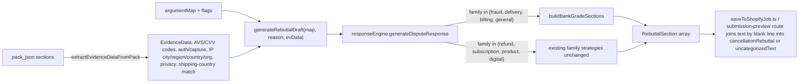

## Scope (confirmed with user: Option A)

Apply the new template ONLY to these reason families:

- `fraud` (FRAUDULENT, UNRECOGNIZED)
- `delivery` (PRODUCT_NOT_RECEIVED)
- `billing` (DUPLICATE)
- `general` (GENERAL)

Leave untouched: `refund` (CREDIT_NOT_PROCESSED), `subscription` (SUBSCRIPTION_CANCELED), `product` (PRODUCT_UNACCEPTABLE), `digital`. Those families' existing strategies target the correct defense (refund processed, cancellation timeline, product conformity) and would regress if replaced with a legitimacy-shape argument.

## Output shape (new)

Six sections, emitted in this exact order, rendered as plain-text paragraphs joined by blank lines. Sections 3 (payment-verification lines), 5 (device & location) are conditionally emitted; sections 1, 2, 4, 6 are always emitted when the strategy runs.

```
1. Opening + explicit reversal request
2. Transaction legitimacy statement
3. Payment verification (AVS/CVV/auth/capture — only lines for signals present)
4. Customer and checkout behavior (only when order confirmation exists)
5. Device and location (only when IP data exists; mismatch neutralized)
6. Closing demand
```

The exact wording matches the user's template. No markdown, no JSON, no diagnostics, no weak language.

## Files I will change

### 1. [lib/argument/responseEngine.ts](lib/argument/responseEngine.ts)

Primary work. Concrete edits:

- Extend `EvidenceData` with the new optional fields the template references:
  - `authorizationSucceeded?: boolean`
  - `captureSucceeded?: boolean`
  - `ipCity?: string | null`
  - `ipRegion?: string | null`
  - `ipCountry?: string | null`
  - `ipOrg?: string | null`
  - `ipNoVpnProxyHosting?: boolean` (true iff `ipinfo.privacy.vpn === false && .proxy === false && .hosting === false`)
  - `ipCountryMatchesShipping?: boolean | null` (null = unknown, triggers neutral phrasing)
- Add a new internal helper `buildBankGradeSections(flags, data): RebuttalSection[]` that emits the six sections. Each subsection is pure: it inspects `flags`/`data` and returns either a `RebuttalSection` or null.
- Replace `fraudStrategy`, `deliveryStrategy`, `billingStrategy`, `generalStrategy` to return a `FamilyStrategy` whose `summary`/`conclusion` are the new Opening / Closing, and whose `sections` array is the output of `buildBankGradeSections`. Because `generateDisputeResponse` already wraps summary→sections→conclusion, the existing assembly path stays intact.
- Subsection gating rules (key for "don't invent evidence"):
  - Opening: always emitted.
  - Transaction legitimacy: emitted iff `flags.avs || flags.cvv || data.authorizationSucceeded || data.captureSucceeded`. Prevents claiming "authorized and captured using valid cardholder credentials" when nothing confirms that.
  - Payment verification: one sentence per signal present. `AVS (Y)` line only if `flags.avs && data.avsCode === "Y"`; `CVV (M)` line only if `flags.cvv && data.cvvCode === "M"`. For other AVS/CVV codes, emit a neutral "returned a match" line without parenthesising the code. Auth and capture lines gated on `data.authorizationSucceeded` / `data.captureSucceeded`.
  - Customer/checkout behavior: gated on `flags.orderConfirmation` (matches existing `orderFlow`).
  - Device & location: gated on `data.ipCity || data.ipCountry`. When `ipCountryMatchesShipping === false` emit the neutralising sentence; when `true` or `null`, omit that clause entirely.
  - Closing: always emitted.
- `defensePosition` classification, `classifyDefensePosition`, and `POSITION_LABELS` stay untouched — they drive the workspace UI, not the text.

### 2. [app/api/disputes/[id]/argument/route.ts](app/api/disputes/[id]/argument/route.ts)

`generateRebuttalDraft` already accepts an optional `evidenceData` parameter that the route currently does not pass. Add a small extraction step before the call:

```ts
const packJson = (pack.pack_json ?? {}) as { sections?: RawPackSection[] };
const evidenceData = extractEvidenceDataFromPack(packJson.sections ?? [], dispute);
const rebuttalDraft = generateRebuttalDraft(argumentMap, rebuttalReason, evidenceData);
```

Add a new helper `extractEvidenceDataFromPack` in [lib/argument/evidenceDataFromPack.ts](lib/argument/evidenceDataFromPack.ts) (new file, small, pure — no I/O). It:

- Finds the `Payment Verification (AVS/CVV)` section (by `label`) and reads `avsResultCode` / `cvvResultCode`.
- Infers `authorizationSucceeded` from presence of a successful SALE/AUTHORIZATION transaction snapshot if the pack already persists that (reuse any field already on the section; otherwise leave undefined so the line is suppressed — do not invent).
- Finds the IP / device-location section (`fieldMapping.ts` already recognises these by label keywords like `"IP & Location Check"` / `"Device / IP evidence"`) and reads `ipinfo.city`, `ipinfo.region`, `ipinfo.country`, `ipinfo.org`, `ipinfo.privacy`.
- Compares `ipinfo.country` to the shipping country (read from any section exposing shipping address) to set `ipCountryMatchesShipping`. If either side is missing, leave `null` and the formatter omits the neutralising clause.

### 3. [lib/argument/__tests__/responseEngine.bankGrade.test.ts](lib/argument/__tests__/responseEngine.bankGrade.test.ts) (new)

Cover the per-rule requirements the user listed:

- Fraud family with full signals produces opening + all 4 payment lines + customer behavior + device & location + closing, in that order.
- Each payment line is omitted when its signal is missing (AVS alone, CVV alone, auth alone, capture alone, none).
- IP section omitted when no IP data. Emitted when IP present. Mismatch with shipping country neutralised with the exact sentence from the template. VPN/proxy/hosting flags rendered as `"No VPN, proxy, or hosting indicators were detected"` when all three are false; sentence omitted when unknown.
- Output is plain text — assertion `expect(text).not.toMatch(/[\{\}\[\]]/)` and `expect(text).not.toMatch(/"\s*:/)` to guard against JSON leakage.
- No weak language: `expect(text).not.toMatch(/\b(may|might|weak|risk|uncertain|appears)\b/i)`.
- No internal diagnostics: `expect(text).not.toMatch(/\b(score|risk level|bank eligible|checklist|completeness)\b/i)`.
- Opening contains the exact reversal-request phrase; closing contains the exact reverse-funds phrase.
- Delivery family (PRODUCT_NOT_RECEIVED) and billing family (DUPLICATE) produce the same template shape (regression guard that Option A scope actually landed).
- Refund / subscription / product families produce their existing output unchanged (regression guard — keep a snapshot-style assertion on the summary/conclusion).

### 4. [lib/argument/__tests__/evidenceDataFromPack.test.ts](lib/argument/__tests__/evidenceDataFromPack.test.ts) (new)

Unit tests for the extractor: AVS/CVV codes read correctly, IP narrative fields populated from `ipinfo`, shipping-country compare returns true / false / null as expected, nothing invented when sections are missing.

### 5. [docs/technical.md](docs/technical.md)

Short paragraph under the existing attachment-links / preview-parity section documenting:
- The new six-section bank-grade template, which four families it applies to, and the explicit carve-out for refund / subscription / product / digital.
- That `EvidenceData` is now populated from `pack_json` so AVS/CVV codes and IP narrative are cited in the rebuttal text (never raw JSON).

## Implementation flow



## Acceptance checks before committing

- `npx vitest run lib/argument lib/shopify lib/links tests/unit` — all green.
- `ReadLints` clean on the four touched files.
- Manual before/after snippet captured in the commit message and pasted back to the user (per the user's output expectation).

## Out of scope (will NOT do)

- Changing evidence collection, scoring, or `fieldMapping.ts`.
- Touching the refund, subscription, product, or digital family strategies.
- Regenerating already-persisted `rebuttal_drafts` rows (next `/argument` POST with `regenerate=true` will rebuild them).
- Touching the reason-aware manual-attachment formatter shipped in the last commit.