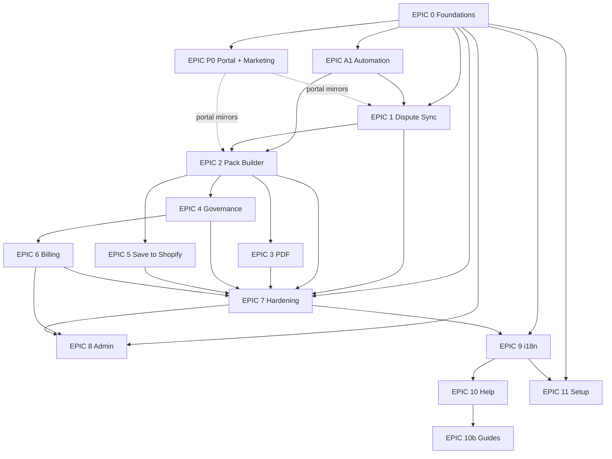

# DisputeDesk — Epic plan (single sheet)

**Purpose:** One place to see what each epic is, whether it is done, what depends on what, and what to do next.  
**Roadmap snapshot:** See also [`docs/roadmap.md`](../roadmap.md) for dates and product notes.

---

## 1. How numbering works

| Pattern | Meaning | Example |
|---------|---------|---------|
| **0, 1, 2, …** | Main product epics in rough build order | EPIC-1 Dispute Sync |
| **P0** | "Parallel track 0" — portal + marketing (not "phase zero" of something else) | EPIC-P0 |
| **A1** | "Automation track" — pipeline that other epics sit on | EPIC-A1 |
| **10b** | Add-on epic that extends EPIC-10 | Help guides |
| **CH-1 … CH-7** | **Content Hub** epics (marketing CMS). **Not** the same as EPIC-P0. | CH-2 = admin shell + components |

---

## 2. All epics — one table

Read this table top-to-bottom for historical order. **Status** is V1 intent (see `roadmap.md` for exceptions like A1).

| ID | Name | Status | Detail doc |
|----|------|--------|------------|
| **0** | Foundations | Done | [EPIC-0-foundations.md](EPIC-0-foundations.md) |
| **P0** | External Portal + Marketing | Done | [EPIC-P0-portal-marketing.md](EPIC-P0-portal-marketing.md) |
| **A1** | Automation Pipeline | In progress | [EPIC-A1-automation-pipeline.md](EPIC-A1-automation-pipeline.md) |
| **1** | Dispute Sync | Done | [EPIC-1-dispute-sync.md](EPIC-1-dispute-sync.md) |
| **2** | Evidence Pack Builder | Done | [EPIC-2-evidence-pack-builder.md](EPIC-2-evidence-pack-builder.md) |
| **3** | PDF Rendering & Storage | Done | [EPIC-3-pdf-rendering.md](EPIC-3-pdf-rendering.md) |
| **4** | Governance & Review Queue | Done | [EPIC-4-governance.md](EPIC-4-governance.md) |
| **5** | Save Evidence to Shopify | Done | [EPIC-5-save-to-shopify.md](EPIC-5-save-to-shopify.md) |
| **6** | Billing & Plan Limits | Done | [EPIC-6-billing.md](EPIC-6-billing.md) |
| **7** | Hardening | Done | [EPIC-7-hardening.md](EPIC-7-hardening.md) |
| **8** | Internal Admin Panel | Done | [EPIC-8-admin-panel.md](EPIC-8-admin-panel.md) |
| **9** | Multi-Language (i18n) | Done | [EPIC-9-i18n.md](EPIC-9-i18n.md) |
| **10** | User Help System | Done | [EPIC-10-help-system.md](EPIC-10-help-system.md) |
| **10b** | Interactive Help Guides | Done | *(no separate file — see roadmap)* |
| **11** | Setup Wizard & Onboarding | Done | *(see roadmap Notes)* |

---

## 3. Dependencies (plain English)

1. **Foundations (0)** must exist before almost anything (DB, auth, app shell).
2. **Automation (A1)** is the backbone for sync + pack behaviour; it feeds **EPIC-1** and **EPIC-2**.
3. **Portal + marketing (P0)** runs in parallel: portal screens *mirror* product features as they land (dashed lines in the diagram), not a hard blocker for core merchant flows in Admin.
4. **Dispute sync (1)** → **Pack builder (2)** → **PDF (3)**, **Governance (4)**, **Save to Shopify (5)** (4 and 5 branch from pack work).
5. **Governance (4)** → **Billing (6)** (plan limits / review behaviour).
6. **Hardening (7)** receives work from the core dispute/pack path (1–6).
7. **Admin (8)** needs billing in place for many ops workflows; follows a lot of core + hardening.
8. **i18n (9)** after hardening in the plan; then **Help (10)** → **10b**; **Setup (11)** uses i18n.

If you only remember one chain: **0 → A1 → 1 → 2 → (3,4,5) → 6 → 7 → 8 → 9 → 10 → 10b**, with **P0** parallel.

---

## 4. Dependency diagram (same as roadmap, for visual learners)

---

## 5. Content Hub (marketing CMS) — separate track

This is **not** a numbered epic **0–11**. Full epics for **CH-1 through CH-7** live in **[`RESOURCE-HUB-PLAN.md`](RESOURCE-HUB-PLAN.md)** (canonical).

| ID | Name | Status |
|----|------|--------|
| **CH-1** | Foundation | Done |
| **CH-2** | Admin Shell + Component System | Next |
| **CH-3** | Dashboard + Content List | Planned |
| **CH-4** | Block Editor + Locale Editing | Planned |
| **CH-5** | Backlog + Calendar + Queue | Planned |
| **CH-6** | Settings + Polish + Mobile | Planned |
| **CH-7** | Generation Pipeline | Active (parallel) |

**Embedded Shopify app:** Content Hub pages are **not** in `/app/*`. In-app help is `/app/help`. Middleware redirects hub URLs loaded with embedded `?host=` to `/app/help`.

---

## 6. What to do next (rolling)

| Item | Type | Note |
|------|------|------|
| **EPIC A1** | Core epic | Still "In progress" on roadmap — finish automation pipeline scope per [EPIC-A1](EPIC-A1-automation-pipeline.md). |
| **CH-2** | Content Hub | ~~Admin shell + component system~~ **Done.** |
| **CH-3** | Content Hub | ~~Dashboard + Content List~~ **Done.** |
| **CH-4** | Content Hub | ~~Block Editor + Locale Editing~~ **Done.** |
| **CH-5** | Content Hub | Backlog + Calendar + Queue; see [RESOURCE-HUB-PLAN.md](RESOURCE-HUB-PLAN.md). **Next.** |
| **CH-7** | Content Hub | Generation pipeline (parallel track); see [RESOURCE-HUB-PLAN.md](RESOURCE-HUB-PLAN.md). |

---

## 7. File index (`docs/epics/`)

| File |
|------|
| [EPIC-PLAN.md](EPIC-PLAN.md) — **this file** |
| [RESOURCE-HUB-PLAN.md](RESOURCE-HUB-PLAN.md) — Content Hub (CH-1 through CH-7) |
| [EPIC-0-foundations.md](EPIC-0-foundations.md) |
| [EPIC-P0-portal-marketing.md](EPIC-P0-portal-marketing.md) |
| [EPIC-A1-automation-pipeline.md](EPIC-A1-automation-pipeline.md) |
| [EPIC-1-dispute-sync.md](EPIC-1-dispute-sync.md) |
| [EPIC-2-evidence-pack-builder.md](EPIC-2-evidence-pack-builder.md) |
| [EPIC-3-pdf-rendering.md](EPIC-3-pdf-rendering.md) |
| [EPIC-4-governance.md](EPIC-4-governance.md) |
| [EPIC-5-save-to-shopify.md](EPIC-5-save-to-shopify.md) |
| [EPIC-6-billing.md](EPIC-6-billing.md) |
| [EPIC-7-hardening.md](EPIC-7-hardening.md) |
| [EPIC-8-admin-panel.md](EPIC-8-admin-panel.md) |
| [EPIC-9-i18n.md](EPIC-9-i18n.md) |
| [EPIC-10-help-system.md](EPIC-10-help-system.md) |
