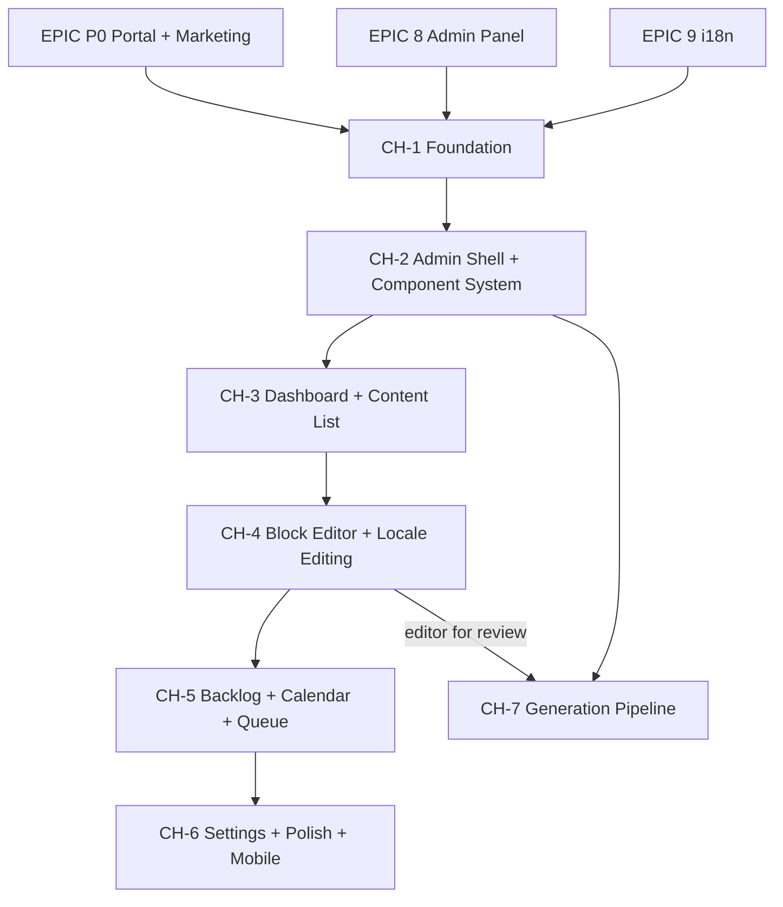

# Resources Hub — Epic Plan

> **Canonical roadmap for the Content Hub (marketing CMS) only.**
> For core product epics (0–11), see [EPIC-PLAN.md](EPIC-PLAN.md). This file does not repeat them.
> **Figma design:** [DisputeDesk Shopify App Design — Admin Resources](https://www.figma.com/make/5o2yOdPqVmvwjaK8eTeUUx/DisputeDesk-Shopify-App-Design?preview-route=%2Fportal%2Fadmin%2Fresources)
> **Figma PRD (admin):** The design was generated from a detailed product requirements document specifying 8 admin screens, reusable component system, 11 workflow statuses, 7 content types, 6 supported languages, and complete editorial lifecycle from idea → published.

**Related docs:**
[resources-hub-editor-guide.md](../resources-hub-editor-guide.md) (operations) ·
[technical.md](../technical.md) § Resources Hub ·
[resources-hub-article-generation-prd.md](../resources-hub-article-generation-prd.md) (CH-3 spec)

---

## Purpose

The **Resources Hub** is DisputeDesk's **SEO / editorial** surface: localized routes for articles, templates, case studies, glossary, and blog content stored in Supabase, edited via **Admin → Resources**, published via cron.

- **Is:** Discoverable marketing content that drives acquisition and education.
- **Is not:** The embedded Shopify app. Merchants use `/app/help` for in-app help (`lib/help/embedded`). Middleware redirects hub URLs with App Bridge `?host=` to `/app/help` (see `lib/middleware/marketingHubPaths.ts`).

Phase codes **CH-1 / CH-2 / CH-3** are used so they never collide with **EPIC-P0** or the numbered product epics.

---

## Dependency diagram



---

## Figma Source Files (reference)

All Figma Make source files live at `figma://make/source/5o2yOdPqVmvwjaK8eTeUUx/src/app/`. The following are the canonical design references for each screen:

| Figma Source File | Maps to Epic | Admin Route |
|---|---|---|
| `components/admin-shell.tsx` | CH-2 | Layout wrapper |
| `components/admin/editor-components.tsx` | CH-2, CH-4 | Shared components |
| `pages/admin/resources-dashboard.tsx` | CH-3 | `/admin/resources` |
| `pages/admin/resources-list.tsx` | CH-3 | `/admin/resources/list` |
| `pages/admin/resources-editor.tsx` | CH-4 | `/admin/resources/content/[id]` |
| `pages/admin/resources-editor-mobile.tsx` | CH-6 | `/admin/resources/content/[id]` (mobile) |
| `pages/admin/resources-backlog.tsx` | CH-5 | `/admin/resources/backlog` |
| `pages/admin/resources-calendar.tsx` | CH-5 | `/admin/resources/calendar` |
| `pages/admin/resources-queue.tsx` | CH-5 | `/admin/resources/queue` |
| `pages/admin/resources-settings.tsx` | CH-6 | `/admin/resources/settings` |

---

## Workflow Statuses (full lifecycle)

```
idea → backlog → brief_ready → drafting → in_translation →
  in_editorial_review → in_legal_review → approved → scheduled → published → archived
```

Status badges use the design system defined in the Figma component library. Each status has a distinct color token, icon, and border treatment.

## Content Types

| Type | Badge Label | Use |
|---|---|---|
| `pillar_page` | Pillar Page | Cornerstone SEO content |
| `cluster_article` | Article | Supporting cluster articles |
| `template` | Template | Downloadable evidence/response templates |
| `case_study` | Case Study | Customer success stories |
| `legal_update` | Legal Update | Regulatory/compliance changes |
| `glossary_entry` | Glossary | Terminology definitions |
| `faq_entry` | FAQ | Frequently asked questions |

## Supported Languages

| Locale | Label | Flag |
|---|---|---|
| `en` / `en-US` | English | 🇬🇧 |
| `de` / `de-DE` | Deutsch | 🇩🇪 |
| `fr` / `fr-FR` | Français | 🇫🇷 |
| `es` / `es-ES` | Español | 🇪🇸 |
| `pt` / `pt-PT` | Português | 🇵🇹 |
| `sv` / `sv-SE` | Svenska | 🇸🇪 |

---

# EPIC CH-1 — Foundation ✅

> **Status:** Done
> **Dependencies:** EPIC-0, EPIC-P0, EPIC-8, EPIC-9

## Goal

Stand up the public hub, content model, publish pipeline, and first admin tooling so operators can create, localize, schedule, and publish articles across 6 locales.

## Tasks

### CH-1.1 — Content Model + Migration

- `supabase/migrations/030_resources_hub.sql`: `content_items`, `content_localizations`, `content_publish_queue`, `content_archive_items`, `content_revisions`.
- RLS policies; service role access.

### CH-1.2 — Public Hub Pages

- `app/[locale]/resources/page.tsx` — hub landing.
- `app/[locale]/resources/[pillar]/page.tsx` — pillar listing.
- `app/[locale]/resources/[pillar]/[slug]/page.tsx` — article detail.
- `components/resources/ResourcesHubShell.tsx` — shared layout with `MARKETING_PAGE_CONTAINER_CLASS`.
- `components/resources/HubSectionNav.tsx`, `ResourceBreadcrumbs.tsx`, `CtaBlock.tsx`, `BodyBlocks.tsx`.

### CH-1.3 — Locale Strategy

- `lib/resources/localeMap.ts` — maps DB locales (`en-US`, `de-DE`, `fr-FR`, `es-ES`, `pt-PT`, `sv-SE`) to next-intl.
- 6 supported locales aligned with `resources-hub-editor-guide.md`.

### CH-1.4 — Content Queries + URL Helpers

- `lib/resources/queries.ts` — published content lookups.
- `lib/resources/url.ts` — canonical URL builder.
- `lib/resources/constants.ts` — pillar slugs, content type enums.

### CH-1.5 — Publish Pipeline

- `lib/resources/publish.ts` — `publishLocalization` with validation (tags ≥ 3, author, CTA, body, metadata).
- `app/api/cron/publish-content/route.ts` — `GET`/`POST` cron endpoint.

### CH-1.6 — Admin Tooling (Phase 1)

- `/admin/resources` — content list.
- `/admin/resources/content/[id]` — JSON inspector view.
- `/admin/resources/calendar` — publish queue table.
- `/admin/resources/archive` — archive items.
- `/admin/resources/settings` — basic settings.
- Editor guide documents Supabase Table Editor as fallback.

### CH-1.7 — Embedded App Guard

- `lib/middleware/marketingHubPaths.ts` — path matcher.
- `middleware.ts` — redirect hub URLs with `?host=` to `/app/help`.
- `tests/unit/marketingHubPaths.test.ts`.

### CH-1.8 — SEO + Analytics

- `lib/resources/schema/jsonLd.ts` — JSON-LD structured data.
- `lib/resources/analytics.ts` — hub analytics helpers.

### CH-1.9 — Documentation

- `docs/resources-hub-editor-guide.md`.
- `docs/technical.md` § Resources Hub.
- `docs/roadmap.md` Content Hub section.

## Acceptance Criteria

- [x] Migration `030_resources_hub.sql` applied; all content tables in use.
- [x] Hub UI renders at `/resources`, `/resources/{pillar}`, `/resources/{pillar}/{slug}` with locale prefixes.
- [x] Publish cron validates and publishes localizations.
- [x] Admin entry at `/admin/resources` with Phase-1 tooling; guide documents fallback workflows.
- [x] i18n: 6 locales aligned with editor guide.
- [x] Embedded app guard redirects hub URLs with `?host=` to `/app/help`.
- [x] JSON-LD structured data on article pages.
- [x] Documentation published.

---

# EPIC CH-2 — Admin Shell + Component System ✅

> **Status:** Done
> **Dependencies:** CH-1
> **Delivery:** Admin shell layout, workflow model migration, reusable component library

## Goal

Build the structural foundation for the new admin: the shell layout with left sidebar navigation, the workflow status model with server-side state machine, content type taxonomy migration, and the shared component library that all subsequent screens depend on. No new pages yet — just the scaffolding.

## Figma Reference

- `components/admin-shell.tsx` — left sidebar, top bar, mobile hamburger
- `components/admin/editor-components.tsx` — reusable components

## Tasks

### CH-2.1 — Workflow Status Migration

- Add `workflow_status` column to `content_items` supporting: `idea`, `backlog`, `brief_ready`, `drafting`, `in_translation`, `in_editorial_review`, `in_legal_review`, `approved`, `scheduled`, `published`, `archived`.
- Server-side transition validation (prevent invalid state jumps, e.g., cannot go from `idea` directly to `published`).
- Migrate existing content: current `published` items → `published`, drafts → `drafting`.
- `lib/resources/workflow.ts` — state machine definition with allowed transitions.

### CH-2.2 — Content Type + Planning Columns

- Add to `content_items`: `content_type` enum (`pillar_page`, `cluster_article`, `template`, `case_study`, `legal_update`, `glossary_entry`, `faq_entry`).
- Add planning columns: `topic`, `target_keyword`, `search_intent`, `priority` (`high` / `medium` / `low`).
- Migration script to backfill `content_type` from existing `type` field.

### CH-2.3 — Admin Shell Layout

Rewrite `app/admin/layout.tsx` to match Figma `admin-shell.tsx`:

- **Left sidebar** (w-64, white, border-right):
  - DisputeDesk logo + "Admin Portal" subtitle.
  - "Back to Portal" button.
  - Navigation section "Resources Hub": Dashboard, Content List, Calendar, Queue, Backlog, Settings.
  - Active state: `bg-[#E0F2FE] text-[#0EA5E9]`.
  - Admin info footer: "Admin Access — Content Management" badge.
- **Top bar** (h-16, white, border-bottom, sticky):
  - Mobile hamburger (lg:hidden).
  - Page title + subtitle.
  - Notification bell (with unread dot).
  - User avatar.
- **Mobile sidebar**: Overlay + slide-in with transition.
- **Main content area**: `flex-1 overflow-auto`.

### CH-2.4 — Component Library

Build reusable admin components in `components/admin/resources/`:

| Component | Source | Purpose |
|---|---|---|
| `WorkflowStatusBadge` | `editor-components.tsx` | Status pill with icon + color per workflow state |
| `ContentTypeBadge` | Inline in list/dashboard | Type label with neutral styling |
| `LocaleCompletenessBadge` | `resources-editor.tsx` | Per-locale progress with flag, %, progress bar |
| `LocaleStatusIndicator` | `editor-components.tsx` | Compact inline locale flags (✓/○/—) |
| `ValidationChecklist` | `resources-editor.tsx` | Publishing readiness checklist with progress bar |
| `SchedulePicker` | `resources-editor.tsx` | Date/time modal for scheduling |
| `SEOMetadataPanel` | `editor-components.tsx` | Meta title, description, focus keyword, SEO score |
| `TranslationStatusPanel` | `editor-components.tsx` | Per-locale status with progress bars |
| `AIWritingAssistant` | `editor-components.tsx` | AI suggestions panel (readability, meta, related) |
| `ContentBlockSelector` | `editor-components.tsx` | Block type picker modal |
| `PublishingActionBar` | `editor-components.tsx` | Sticky footer with save/preview/schedule/publish |
| `PriorityBadge` | Backlog styles | High/medium/low with distinct colors |

Color tokens from Figma design system:

```
Primary navy:       #0B1220
Primary blue:       #1D4ED8
Muted text:         #667085
Border:             #E1E3E5
Background surface: #F6F8FB
Success green:      #22C55E / #15803D / #F0FDF4
Warning amber:      #F59E0B / #92400E / #FEF3C7
Error red:          #991B1B / #FEE2E2
Info blue:          #EFF6FF / #BFDBFE
```

### CH-2.5 — Query Layer

- `lib/resources/admin-queries.ts`:
  - `getContentStats()` — counts by workflow status.
  - `getUpcomingScheduled(limit)` — next N scheduled items with locale info.
  - `getTranslationGaps()` — items with missing locale completions.
  - `getRecentlyEdited(limit)` — last N edited items.
  - `getContentList(filters)` — paginated, filterable content list.
  - `getBacklogItems(filters)` — backlog/ideas pipeline.
  - `getQueueItems(statusFilter)` — publish queue entries.
  - `getContentForEditor(id)` — single item with all localizations + revisions.
  - `updateWorkflowStatus(id, newStatus)` — state-machine validated transition.

## Key Files

- New migration: `supabase/migrations/031_workflow_and_types.sql`
- `app/admin/layout.tsx` — full rewrite
- `lib/resources/workflow.ts` — state machine
- `lib/resources/admin-queries.ts` — admin data layer
- `components/admin/resources/*.tsx` — component library (12+ components)

## Acceptance Criteria

- [x] Migration applied: `workflow_status`, `content_type`, `topic`, `target_keyword`, `search_intent`, `priority` columns exist.
- [x] Existing content backfilled with correct workflow status and content type.
- [x] State machine prevents invalid workflow transitions server-side.
- [x] Admin shell matches Figma: left sidebar, top bar, mobile responsive, correct nav items and active states.
- [x] All 12+ reusable components built and storybook/visually verified against Figma.
- [x] Query layer returns correct data for all admin operations.
- [x] No regression to existing admin pages (audit, billing, jobs, shops).

## Risks

- **Layout rewrite breaks existing admin pages:** Mitigation: existing pages (audit, billing, etc.) must continue to render inside the new shell. Test manually before merge.
- **State machine complexity:** 11 statuses with multiple allowed transitions. Mitigation: define transitions as a simple lookup object; write unit tests for every allowed/denied transition.

---

# EPIC CH-3 — Dashboard + Content List ✅

> **Status:** Done
> **Dependencies:** CH-2
> **Delivery:** Two complete admin screens — operational dashboard and content management table

## Goal

Build the two most-used admin screens: the resources dashboard (landing page for the admin section) and the content list (where editors find, filter, and manage all content). Both use the components built in CH-2.

## Figma Reference

- `pages/admin/resources-dashboard.tsx`
- `pages/admin/resources-list.tsx`

## Tasks

### CH-3.1 — Resources Dashboard

Rewrite `/admin/resources` as the editorial operations dashboard:

**Page header:**
- Title: "Resources Hub Admin"
- Subtitle: "Manage articles, templates, and knowledge base content"
- "Create Content" primary button.

**Stats grid (4 KPI cards):**
- Published (count + "+X this week") with green CheckCircle icon.
- Scheduled (count + "Next 30 days") with blue Clock icon.
- In Review (count + "X need attention") with amber Eye icon.
- Draft (count + "X ready to review") with gray Edit icon.

**Upcoming Scheduled panel (2/3 width):**
- List of next 4+ scheduled posts.
- Each row: title, type badge, date/time, locale flags.
- "View Calendar" link.

**Sidebar widgets (1/3 width):**
- **Translation Gaps:** Items with missing locale translations, priority badges, locale flags.
- **Queue Health:** Operational status, last publish time, queue size, "View Queue Details" link.

**Recently Edited table:**
- Columns: Title, Type, Author, Last Edited, Status, Actions (view/edit).
- Status badges using `WorkflowStatusBadge`.
- "View All Content" link.

### CH-3.2 — Content List Page

New page at `/admin/resources/list`:

**Page header:**
- Title: "All Content"
- Subtitle: "Manage and publish resources across all languages"
- "View Backlog" ghost button, "Create Content" primary button.

**Status tabs:**
- All Content (count), Published, Scheduled, In Review, Draft.
- Active tab has blue underline indicator.

**Search + Filter bar (white card):**
- Search input: "Search by title, author, or keyword..."
- Filter toggle button with active dot indicator.
- Bulk actions when items selected: count, "Bulk Edit", "Archive", clear selection.
- Extended filters (collapsible): Content Type dropdown, Topic dropdown, "Clear filters" action.

**Content table:**
- Checkbox column for multi-select.
- Columns: Title, Type (badge), Topic, Status (badge with icon), Locales (6 compact indicators: ✓/○/—), Publish Date, Author, Updated, Actions (view/edit/more).
- Row hover: `bg-[#F6F8FB]`.
- Select all checkbox in header.

**Pagination:**
- "Showing X of Y items"
- Page number buttons, Previous/Next.

## Key Files

- `app/admin/resources/page.tsx` — rewrite as dashboard
- `app/admin/resources/list/page.tsx` — new content list page
- Uses components from `components/admin/resources/` (CH-2.4)
- Uses queries from `lib/resources/admin-queries.ts` (CH-2.5)

## Acceptance Criteria

- [x] Dashboard shows real-time KPIs pulled from database.
- [x] Upcoming scheduled posts show with correct locale flags.
- [x] Translation gaps widget identifies items with missing locales by priority.
- [x] Queue health reflects actual publish queue status.
- [x] Recently edited table shows last 4+ items with correct status badges.
- [x] Content list supports tab filtering by status with accurate counts.
- [x] Search filters content by title, author, keyword in real time.
- [x] Extended filters (content type, topic) narrow results correctly.
- [x] Multi-select with bulk actions (edit, archive) works.
- [x] Locale indicators per row correctly reflect localization completeness.
- [x] Pagination works for large content sets.
- [x] Both screens use the admin shell from CH-2.3.

## Risks

- **Performance with large content sets:** Paginated queries must be indexed. Add DB indexes on `workflow_status`, `content_type`, `updated_at`.
- **Real-time counts:** Stats may become stale during edits. Acceptable for V1; consider SWR/revalidation for V2.

---

# EPIC CH-4 — Block Editor + Locale Editing

> **Status:** Active
> **Dependencies:** CH-3
> **Delivery:** Full content editor with block-based editing, locale switching, and publishing workflow

## Goal

Replace the Phase-1 JSON inspector with a rich block editor. Editors can compose, translate, and publish content entirely through the admin UI without touching raw JSON. This is the most complex and most important screen.

## Figma Reference

- `pages/admin/resources-editor.tsx` (desktop)
- `pages/admin/resources-editor-mobile.tsx` (mobile — delivered in CH-6)

## Tasks

### CH-4.1 — Editor Stack Decision

- Choose block editor library: Tiptap, Editor.js, Plate, or custom block system.
- Decision criteria: bundle size (admin-only so acceptable), `body_json` shape compatibility, multilingual support, extensibility.
- Map chosen library's output format to existing `body_json` shape (or define migration).

### CH-4.2 — Editor Page Layout

Rewrite `/admin/resources/content/[id]`:

**Top navigation (sticky):**
- Back arrow → Content List.
- "Edit Content" title + "Pillar Page · Chargebacks" subtitle.
- Last saved timestamp.
- Actions: Preview, Save Draft, Schedule, Publish.

**Two-column layout (lg:grid-cols-3):**
- **Main editor (2/3):**
  - Locale completeness badges (horizontal scrollable row): per-locale flag, native name, code, % complete, progress bar. Active locale has blue border.
  - Title field (large, `text-lg font-semibold`).
  - Slug field with prefix display (`disputedesk.com/resources/`).
  - Excerpt textarea with character count and SEO quality indicator.
  - Content blocks area: each block is a dashed-border card with type indicator, content input, and remove button. "Add Content Block" button at bottom.
  - Related content picker: list of related items with type badge and remove button, "Add Related" action.
- **Sidebar (1/3):**
  - `ValidationChecklist` — publishing readiness with progress bar, required items, warnings.
  - Metadata panel: Content Type, Topic, Tags (inline badges with remove), Author, Reviewer dropdowns.
  - Workflow Status panel: current status badge, publish date, last updated.
  - CTA Configuration: CTA type dropdown with live preview card.

### CH-4.3 — Block Types

Implement content block types matching Figma `ContentBlockSelector`:
- Paragraph (textarea)
- Heading (h2/h3 input)
- List (bullet/numbered)
- Image (upload with caption)
- Callout (important note/tip)
- Code (code snippet)
- Quote (blockquote)
- Divider (horizontal rule)

Each block: drag-to-reorder (desktop), add/remove, type indicator.

### CH-4.4 — Locale Editing

- Locale tab switching loads per-locale data (title, excerpt, body blocks, metadata).
- Completeness calculated per locale: title filled, excerpt filled, content present, metadata complete.
- Missing locale fields highlighted with warning.
- Save persists to `content_localizations` per locale.

### CH-4.5 — body_json Migration

- If block format differs from current `body_json` shape (`mainHtml`, `keyTakeaways`, `faq`, `disclaimer`, `updateLog`), write a bi-directional adapter:
  - Read: parse existing `body_json` into block editor format.
  - Write: serialize block editor state back to `body_json`.
- Alternatively: extend `body_json` to store blocks alongside legacy fields.
- Existing content must open in the new editor without data loss.

### CH-4.6 — Publishing Workflow Actions

- Save Draft: persist current state without changing workflow status.
- Preview: route to preview rendering (CH-4.7).
- Schedule: open `SchedulePicker` modal → set `scheduled_publish_at` + status → `scheduled`.
- Publish: immediate publish for items that pass validation checklist.
- Workflow status transitions validated server-side via state machine (CH-2.1).

### CH-4.7 — Live Preview

- In-admin preview rendering matching public hub output.
- Uses same components as `app/[locale]/resources/[pillar]/[slug]/page.tsx`.
- Opens in modal or new tab.

## Key Files

- `app/admin/resources/content/[id]/page.tsx` — full rewrite
- `components/admin/editor/` — block editor components (BlockRenderer, BlockToolbar, etc.)
- `lib/resources/body-adapter.ts` — body_json ↔ block format adapter
- Uses components: `LocaleCompletenessBadge`, `ValidationChecklist`, `SchedulePicker`, `SEOMetadataPanel`, `ContentBlockSelector`, etc.

## Acceptance Criteria

- [ ] Editor opens existing content with all fields populated (no data loss from body_json).
- [ ] All 8 block types functional: add, edit, remove, reorder (desktop).
- [ ] Locale switching loads correct per-locale data; completeness badges update live.
- [ ] Validation checklist reflects real field state; publish blocked if required items incomplete.
- [ ] Save Draft persists without status change; Schedule sets datetime; Publish goes live.
- [ ] Slug auto-generated from title but editable.
- [ ] CTA configuration preview reflects selected CTA type.
- [ ] Related content picker adds/removes related items.
- [ ] Tags editable inline with add/remove.
- [ ] Preview renders content matching public hub output.
- [ ] No data loss: existing `body_json` content round-trips through block editor.

## Risks

- **Editor library bundle size:** Admin-only pages; code-split the editor. Monitor initial load.
- **body_json compatibility:** If block format differs from current shape, adapter must handle edge cases. Write thorough tests with existing content fixtures.
- **Complex state management:** Editor has many interrelated fields (blocks, locale, checklist, metadata). Consider `useReducer` or lightweight state lib.

---

# EPIC CH-5 — Backlog + Calendar + Queue

> **Status:** Planned
> **Dependencies:** CH-4
> **Delivery:** Three operational screens for editorial planning and publish monitoring

## Goal

Build the editorial planning tools (backlog/ideas pipeline), publishing calendar (agenda + grid), and publishing queue monitor. These complete the operational side of the admin.

## Figma Reference

- `pages/admin/resources-backlog.tsx`
- `pages/admin/resources-calendar.tsx`
- `pages/admin/resources-queue.tsx`

## Tasks

### CH-5.1 — Backlog / Ideas Pipeline

New or rewrite `/admin/resources/backlog`:

**Page header:**
- Title: "Content Backlog"
- Subtitle: "Editorial planning and content ideas pipeline"
- "View Published" ghost button, "Add Idea" primary button.

**Stats row (4 cards):**
- Ideas count, In Backlog count, Brief Ready count, High Priority count.

**Search + Filter bar:**
- Search by title or keyword.
- Collapsible filters: Priority, Status.

**Backlog table:**
- Columns: Order (#, with up/down arrows), Title (+ notes), Type (badge), Target Keyword (mono), Intent, Priority (colored badge), Locales (flags), Status (badge), Actions ("Convert to Draft" button + edit).
- Reorderable rows (up/down on hover).
- Footer: showing X of Y items, "X ready to start" indicator.

**"Convert to Draft" action:**
- Creates `content_items` row with `workflow_status = drafting`.
- Copies backlog metadata (type, keyword, priority, locales) to new item.

### CH-5.2 — Publishing Calendar

Rewrite `/admin/resources/calendar`:

**Page header:**
- Title: "Publishing Calendar"
- Subtitle: "Schedule and manage upcoming content releases"
- View toggle: Agenda / Calendar.
- "View Queue" ghost button.

**Month navigation:**
- Left/right arrows, month/year display.
- Legend: "X scheduled", "X this week".

**Agenda view:**
- Posts grouped by date.
- Date card: day-of-week, day number, full date, post count.
- Per post: time, type badge, "Scheduled" status badge, title, locale flags (with Globe icon).
- View/Edit actions per post.

**Calendar grid view:**
- 7-column grid (Mon–Sun).
- Days with scheduled posts highlighted (`border-[#1D4ED8] bg-[#EFF6FF]`).
- Dot indicators on days with content.

**Queue health panel (below calendar):**
- 3 cards: system status (green/red), queue size + next publish, average publishing cadence.

### CH-5.3 — Publishing Queue

New or rewrite `/admin/resources/queue`:

**Page header:**
- Title: "Publishing Queue"
- Subtitle: "Monitor and manage scheduled content publishing"
- "View Calendar" ghost button, "Refresh" ghost button.

**Stats row (4 colored cards):**
- Pending (gray), Processing (blue), Succeeded (green), Failed (red).
- Each with icon, count, and label.

**Filter tabs:**
- All Items, Pending, Processing, Succeeded, Failed.
- Active tab: `bg-[#0B1220] text-white`.

**Queue items (card-based list):**
- Per item: status icon (with animation for processing), title, type badge, status badge, locale flags.
- Detail grid: scheduled time, published time (if succeeded), started time (if processing), failed time (if failed), attempt count.
- Error message panel for failed items: red background, alert icon, error text.
- Actions: View, Retry (for failed items).

**Empty state:**
- Centered icon + "No items found" message.

**System status panel:**
- 3 status rows: Publishing Service, Translation Service, CDN Distribution.
- Each: green check icon, name, status text, last check/response time.

## Key Files

- `app/admin/resources/backlog/page.tsx` — new (or rewrite `/admin/resources/archive`)
- `app/admin/resources/calendar/page.tsx` — rewrite
- `app/admin/resources/queue/page.tsx` — new
- Uses queries from `lib/resources/admin-queries.ts`
- Uses components from `components/admin/resources/`

## Acceptance Criteria

- [ ] Backlog shows all idea/backlog/brief-ready items with correct stats.
- [ ] Backlog search and filters (priority, status) work correctly.
- [ ] Row reordering (up/down) persists to database.
- [ ] "Convert to Draft" creates content item with correct initial state.
- [ ] Calendar agenda view groups posts by date with correct locale flags.
- [ ] Calendar grid view highlights days with scheduled posts.
- [ ] Calendar month navigation works.
- [ ] Queue shows all items with correct status, locale flags, timing info.
- [ ] Failed items show error messages and have retry action.
- [ ] Queue filter tabs show correct counts and filter correctly.
- [ ] System status panel reflects actual service health.
- [ ] All three screens use admin shell layout from CH-2.3.

## Risks

- **Backlog reorder performance:** Many items + frequent reorder → many DB writes. Mitigation: use fractional ordering (float `order` column) to minimize updates.
- **Queue health accuracy:** System status panel shows hardcoded "operational" in Figma. V1 can show publish queue stats; real service health monitoring is V2.

---

# EPIC CH-6 — Settings + Polish + Mobile

> **Status:** Planned
> **Dependencies:** CH-5
> **Delivery:** Settings page, mobile editor, cross-screen polish, documentation update

## Goal

Complete the admin section with the settings page, mobile-responsive editor variant, and cross-screen polish. Update documentation to replace JSON inspector workflows with block editor.

## Figma Reference

- `pages/admin/resources-settings.tsx`
- `pages/admin/resources-editor-mobile.tsx`

## Tasks

### CH-6.1 — Settings Page

Rewrite `/admin/resources/settings`:

**Publishing Settings section:**
- Default publish time (time input, UTC label).
- Weekend publishing toggle.
- Auto-save drafts toggle.

**Translation Settings section:**
- Skip publishing for incomplete translations toggle.
- Default locale priority list (ordered, with "Required" badge on English).

**Workflow Settings section:**
- Require reviewer before publishing toggle.
- Archive health threshold (number input + "items" label).
- Default CTA selection dropdown.

**Legal & Disclaimer section:**
- Default legal disclaimer textarea.
- Legal review team email input.

**Settings auto-save notice:**
- Blue info banner: "Settings Auto-saved — Your changes are automatically saved."

### CH-6.2 — Mobile Editor

Adapt editor for mobile screens matching Figma `resources-editor-mobile.tsx`:

**Mobile header (sticky):**
- Back arrow, view/menu icons.
- Title + "Pillar Page · Last saved 2h ago".
- Locale selector button (flag + name + completion %).
- View tabs: Content / Metadata / Checklist (with unread dot on checklist).

**Content view:**
- Title card, Slug card, Excerpt card (with SEO character count), Content blocks (simplified).

**Metadata view:**
- Content Type, Topic, Tags, Author, CTA dropdowns/inputs (stacked cards).

**Checklist view:**
- Progress card with bar and required item count.
- Checklist items (full-width cards with checkboxes).
- Warning banner if required items incomplete.

**Locale picker modal:**
- Bottom sheet: language list with flags, completion %, active indicator.

**Bottom action bar (fixed):**
- Schedule button (ghost), Publish button (primary, disabled if requirements incomplete).

### CH-6.3 — Cross-Screen Polish

- Consistent loading states across all admin screens.
- Error boundaries for data fetch failures.
- Empty states for: no content, no backlog items, empty queue.
- Keyboard navigation for tables (tab, enter to view/edit).
- Toast notifications for save, publish, schedule, error.
- Confirm dialogs for destructive actions (archive, delete).

### CH-6.4 — Documentation Update

- Rewrite `docs/resources-hub-editor-guide.md`: replace JSON inspector workflows with block editor as default.
- Update `docs/technical.md` § Resources Hub with new admin architecture.
- Update `docs/roadmap.md` to reflect CH-2 through CH-6 completion.

## Key Files

- `app/admin/resources/settings/page.tsx` — rewrite
- `app/admin/resources/content/[id]/page.tsx` — mobile responsive additions
- `docs/resources-hub-editor-guide.md` — rewrite
- `docs/technical.md` — update
- `docs/roadmap.md` — update

## Acceptance Criteria

- [ ] Settings page saves and applies all configuration options.
- [ ] Settings persist to database and take effect immediately for new content.
- [ ] Mobile editor responsive with tab layout, locale picker modal, bottom action bar.
- [ ] Mobile editor usable for text editing and metadata on small screens.
- [ ] All admin screens have loading, error, and empty states.
- [ ] Toast notifications for save/publish/schedule/error.
- [ ] Documentation updated: editor guide, technical spec, roadmap.
- [ ] No regressions on desktop layouts when mobile styles added.

## Risks

- **Settings storage:** Need a `content_settings` table or key-value store. Keep simple — single row in a settings table.
- **Mobile block editing UX:** Complex block manipulation is hard on small screens. Mitigation: mobile focuses on text editing + metadata; block reordering desktop-only (per Figma mobile design).

---

# EPIC CH-7 — Article Generation Pipeline

> **Status:** Active (parallel with CH-2+)
> **Dependencies:** CH-1, CH-4 (editor for reviewing generated drafts)

## Goal

Turn archive material into reviewable, localized drafts with human approval before any publish. Generated content flows through the same editorial workflow (CH-2+) as manually created content. No silent auto-publish.

**Spec:** [resources-hub-article-generation-prd.md](../resources-hub-article-generation-prd.md)

## Tasks

### CH-7.1 — Finalize Spec

- Replace stub PRD with agreed flows: prompt architecture, model routing, source-of-truth rules.
- Per-locale tone/style guides (formality, terminology).
- Define eligible content types for generation.

### CH-7.2 — Archive-to-Brief Pipeline

- `content_archive_items` → structured brief → generation queue (new job type or DB queue table).
- Brief includes: target content type, target locales, source material references, keyword targets.

### CH-7.3 — Draft Generation

- Model call → `body_json` per locale → new `content_items` + `content_localizations` rows with `workflow_status = drafting`.
- Preserve `created_from_archive_to_content_item_id` link.
- Revision history: every save recorded in `content_revisions`.

### CH-7.4 — Review Workflow + AI Assistant

- Generated drafts enter editorial/legal review via workflow statuses.
- Legal review mandatory for `legal_update` and jurisdiction-scoped content.
- AI writing assistant panel (from Figma design): improve readability, generate meta description, suggest related topics.
- Integrates with editor sidebar (`AIWritingAssistant` component from CH-2.4).

### CH-7.5 — Publish Integration

- Approved drafts enqueue through existing `content_publish_queue` and cron.
- Same validation gates as manual content.

### CH-7.6 — Analytics + Quality

- Track edit distance between generated and published versions.
- Rejection reasons and time-to-publish metrics.

### CH-7.7 — Backlog Integration

- "Generate Draft" action from backlog items (CH-5.1) feeds into this pipeline.
- Status transitions: `brief_ready` → generation queue → `drafting`.

## Key Files

- `lib/resources/generation/` — pipeline orchestrator, prompt templates, model routing.
- `app/api/resources/generate/route.ts` (or `lib/jobs/handlers/generateDraftJob.ts`).
- Updates to `app/admin/resources/content/[id]/page.tsx` — AI assistant panel.
- Updates to `app/admin/resources/backlog/page.tsx` — "Generate Draft" action.
- Update to stub PRD: `docs/resources-hub-article-generation-prd.md`.

## Acceptance Criteria

- [ ] Spec complete: stub PRD replaced with agreed flows, model/policy, and review states.
- [ ] Archive items can be converted to briefs and queued for generation.
- [ ] Generated drafts appear as `content_items` with `workflow_status = drafting` and revision history.
- [ ] AI assistant panel functional in editor (readability, meta description, related topics).
- [ ] Legal review enforced for applicable content types.
- [ ] Approved generated drafts publish through existing queue/cron with same validation.
- [ ] Analytics track edit distance, rejection reasons, time-to-publish.
- [ ] Backlog "Generate Draft" action triggers pipeline.

## Risks

- **Factuality:** Generated content about card network rules must be accurate. Mitigation: mandatory editorial/legal review; source-of-truth rules in prompts.
- **Legal review bottleneck:** Jurisdiction-scoped content needs legal sign-off. Mitigation: `in_legal_review` workflow status with notification to legal team email.
- **Multilingual quality:** Machine-translated content quality varies. Mitigation: per-locale style guides; human review for all locales before publish.
- **Cost control:** Model calls per locale per article. Mitigation: generation only on explicit "Generate" action, never automatic; budget tracking.

---

## Non-goals

- Replace **EPIC-P0**: hub work uses public marketing routes and admin built under prior epics.
- Replace **embedded help**: `/app/help` remains the in-admin experience.
- Auto-publish generated content without human approval (explicitly out of scope).

---

## Summary: Delivery Sequence

| Epic | Name | Delivers | Status |
|---|---|---|---|
| **CH-1** | Foundation | Content model, public hub, pipeline, Phase-1 admin | ✅ Done |
| **CH-2** | Admin Shell + Components | Shell layout, workflow model, component library, query layer | Next |
| **CH-3** | Dashboard + Content List | 2 screens: operations dashboard, content table | Planned |
| **CH-4** | Block Editor + Locale Editing | Full content editor with blocks, locales, publishing | Planned |
| **CH-5** | Backlog + Calendar + Queue | 3 screens: ideas pipeline, calendar, queue monitor | Planned |
| **CH-6** | Settings + Polish + Mobile | Settings page, mobile editor, docs update | Planned |
| **CH-7** | Generation Pipeline | AI draft generation with human review | Active (parallel) |

Each epic has clear acceptance criteria and a defined set of files to create or modify. Epics are sequenced so that each builds on the foundation of the previous one, with CH-7 running in parallel once CH-4 provides the editor for reviewing generated content.

---

## File location

This document lives at **`docs/epics/RESOURCE-HUB-PLAN.md`** and is versioned with the codebase.
