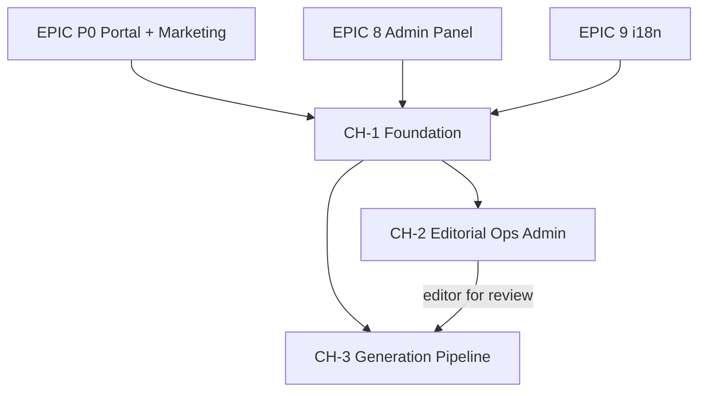

# Resources Hub — Epic Plan

> **Canonical roadmap for the Content Hub (marketing CMS) only.**
> For core product epics (0--11), see [EPIC-PLAN.md](EPIC-PLAN.md). This file does not repeat them.
> **Figma design:** [DisputeDesk Shopify App Design -- Admin Resources](https://www.figma.com/make/5o2yOdPqVmvwjaK8eTeUUx/DisputeDesk-Shopify-App-Design?preview-route=%2Fportal%2Fadmin%2Fresources)

**Related docs:**
[resources-hub-editor-guide.md](../resources-hub-editor-guide.md) (operations) ·
[technical.md](../technical.md) § Resources Hub ·
[resources-hub-article-generation-prd.md](../resources-hub-article-generation-prd.md) (CH-3 spec)

---

## Purpose

The **Resources Hub** is DisputeDesk's **SEO / editorial** surface: localized routes for articles, templates, case studies, glossary, and blog content stored in Supabase, edited via **Admin → Resources**, published via cron.

- **Is:** Discoverable marketing content that drives acquisition and education.
- **Is not:** The embedded Shopify app. Merchants use `/app/help` for in-app help (`lib/help/embedded`). Middleware redirects hub URLs with App Bridge `?host=` to `/app/help` (see `lib/middleware/marketingHubPaths.ts`).

Phase codes **CH-1 / CH-2 / CH-3** are used so they never collide with **EPIC-P0** or the numbered product epics.

---

## Dependency diagram

---

# EPIC CH-1 — Foundation

> **Status:** Done
> **Dependencies:** EPIC-0, EPIC-P0, EPIC-8, EPIC-9

## Goal

Stand up the public hub, content model, publish pipeline, and first admin tooling so operators can create, localize, schedule, and publish articles across 6 locales.

## Tasks

### CH-1.1 — Content Model + Migration

- `supabase/migrations/030_resources_hub.sql`: `content_items`, `content_localizations`, `content_publish_queue`, `content_archive_items`, `content_revisions`.
- RLS policies; service role access.

### CH-1.2 — Public Hub Pages

- `app/[locale]/resources/page.tsx` — hub landing.
- `app/[locale]/resources/[pillar]/page.tsx` — pillar listing.
- `app/[locale]/resources/[pillar]/[slug]/page.tsx` — article detail.
- `components/resources/ResourcesHubShell.tsx` — shared layout with `MARKETING_PAGE_CONTAINER_CLASS`.
- `components/resources/HubSectionNav.tsx`, `ResourceBreadcrumbs.tsx`, `CtaBlock.tsx`, `BodyBlocks.tsx`.

### CH-1.3 — Locale Strategy

- `lib/resources/localeMap.ts` — maps DB locales (`en-US`, `de-DE`, `fr-FR`, `es-ES`, `pt-PT`, `sv-SE`) to next-intl.
- 6 supported locales aligned with `resources-hub-editor-guide.md`.

### CH-1.4 — Content Queries + URL Helpers

- `lib/resources/queries.ts` — published content lookups.
- `lib/resources/url.ts` — canonical URL builder.
- `lib/resources/constants.ts` — pillar slugs, content type enums.

### CH-1.5 — Publish Pipeline

- `lib/resources/publish.ts` — `publishLocalization` with validation (tags ≥ 3, author, CTA, body, metadata).
- `app/api/cron/publish-content/route.ts` — `GET`/`POST` cron endpoint.

### CH-1.6 — Admin Tooling (Phase 1)

- `/admin/resources` — content list.
- `/admin/resources/content/[id]` — JSON inspector view.
- `/admin/resources/calendar` — publish queue table.
- `/admin/resources/archive` — archive items.
- `/admin/resources/settings` — basic settings.
- Editor guide documents Supabase Table Editor as fallback.

### CH-1.7 — Embedded App Guard

- `lib/middleware/marketingHubPaths.ts` — path matcher.
- `middleware.ts` — redirect hub URLs with `?host=` to `/app/help`.
- `tests/unit/marketingHubPaths.test.ts`.

### CH-1.8 — SEO + Analytics

- `lib/resources/schema/jsonLd.ts` — JSON-LD structured data.
- `lib/resources/analytics.ts` — hub analytics helpers.

### CH-1.9 — Documentation

- `docs/resources-hub-editor-guide.md`.
- `docs/technical.md` § Resources Hub.
- `docs/roadmap.md` Content Hub section.

## Key Files

- `supabase/migrations/030_resources_hub.sql`
- `app/[locale]/resources/page.tsx`, `[pillar]/page.tsx`, `[pillar]/[slug]/page.tsx`
- `components/resources/ResourcesHubShell.tsx`, `HubSectionNav.tsx`, `BodyBlocks.tsx`, `CtaBlock.tsx`, `ResourceBreadcrumbs.tsx`
- `lib/resources/publish.ts`, `queries.ts`, `localeMap.ts`, `url.ts`, `constants.ts`, `analytics.ts`, `schema/jsonLd.ts`
- `app/api/cron/publish-content/route.ts`
- `app/admin/resources/page.tsx`, `content/[id]/page.tsx`, `calendar/page.tsx`, `archive/page.tsx`, `settings/page.tsx`
- `lib/middleware/marketingHubPaths.ts`, `tests/unit/marketingHubPaths.test.ts`

## Acceptance Criteria

- [x] Migration `030_resources_hub.sql` applied; all content tables in use.
- [x] Hub UI renders at `/resources`, `/resources/{pillar}`, `/resources/{pillar}/{slug}` with locale prefixes.
- [x] Publish cron validates and publishes localizations.
- [x] Admin entry at `/admin/resources` with Phase-1 tooling; guide documents fallback workflows.
- [x] i18n: 6 locales aligned with editor guide.
- [x] Embedded app guard redirects hub URLs with `?host=` to `/app/help`.
- [x] JSON-LD structured data on article pages.
- [x] Documentation published.

## Risks (retrospective)

- **Supabase Table Editor dependency:** Mitigated by documenting workarounds; CH-2 replaces this entirely.
- **Content model iteration:** Schema proved stable; `body_json` shape works for both JSON inspector and future block editor.

---

# EPIC CH-2 — Editorial Operations Admin

> **Status:** Active (next)
> **Dependencies:** CH-1

## Goal

Replace the Phase-1 JSON inspector with a full editorial operations admin per the [Figma design](https://www.figma.com/make/5o2yOdPqVmvwjaK8eTeUUx/DisputeDesk-Shopify-App-Design?preview-route=%2Fportal%2Fadmin%2Fresources). 8 screens covering the complete editorial lifecycle: create, edit blocks, translate, review, schedule, and publish — without touching raw JSON.

## Tasks

### CH-2.1 — Workflow Status Model

- Add `workflow_status` to content model supporting: `idea`, `backlog`, `brief_ready`, `drafting`, `in_translation`, `in_editorial_review`, `in_legal_review`, `approved`, `scheduled`, `published`, `archived`.
- Migration + server-side transition validation (prevent invalid state jumps).

### CH-2.2 — Content Type Taxonomy

- Add `content_type` column: `pillar_page`, `cluster_article`, `template`, `case_study`, `legal_update`, `glossary_entry`, `faq_entry`.
- Add `topic`, `target_keyword`, `search_intent`, `priority` columns for backlog/planning.
- Migration.

### CH-2.3 — Resources Dashboard

- Rewrite `/admin/resources` as an editorial operations dashboard.
- KPI cards: published, scheduled, in-review, draft counts.
- Upcoming scheduled posts with locale flags.
- Translation gaps widget (items with missing locales, by priority).
- Queue health indicator.
- Recently edited table with status badges.

### CH-2.4 — Content List Page

- `/admin/resources/list` (or tab on dashboard).
- Filterable table: status tabs (all / published / scheduled / in-review / draft).
- Search by title, author, keyword.
- Extended filters: content type, topic.
- Locale completeness per row (6 locales: check / in-progress / missing).
- Bulk actions (edit, archive).
- Pagination.

### CH-2.5 — Block Editor

- Choose editor stack (Tiptap, Editor.js, Plate, or custom block system). Map to `body_json`.
- Rebuild `/admin/resources/content/[id]`:
  - Locale completeness badges (per-locale progress with %).
  - Title, slug, excerpt fields.
  - Block-based body: paragraph, heading, list, image, callout, code, quote, divider.
  - Sidebar: publishing checklist (required items, progress bar), metadata panel (content type, topic, tags, author, reviewer), workflow status, CTA configuration, related content picker.
  - Schedule picker modal.
- Mobile responsive via tab layout (content / metadata / checklist) with locale picker modal and bottom action bar.

### CH-2.6 — Live Preview

- In-admin preview rendering matching public hub output.
- Editors see what visitors see before publish.

### CH-2.7 — Backlog / Ideas Pipeline

- `/admin/resources/backlog`.
- Table: title, content type, target keyword, search intent, priority (high/medium/low), target locales, order, status (idea / backlog / brief-ready), notes.
- "Convert to Draft" action creates `content_items` row with `workflow_status = drafting`.
- Stats: ideas count, backlog count, brief-ready count, high priority count.
- Search + priority/status filters.

### CH-2.8 — Publishing Calendar

- Rewrite `/admin/resources/calendar`.
- Agenda view: posts grouped by date, time, type badge, locale flags.
- Calendar grid view: month navigation, dots on days with scheduled posts.
- Queue health panel.

### CH-2.9 — Publishing Queue

- `/admin/resources/queue`.
- Status tabs: pending, processing, succeeded, failed.
- Per item: title, type, locales, scheduled time, attempt count, error messages.
- Retry action for failed items.
- System status panel (publishing service, translation service, CDN distribution).

### CH-2.10 — Settings Page

- Rewrite `/admin/resources/settings`.
- Default publish time (UTC).
- Weekend publishing toggle.
- Skip publishing for incomplete translations.
- Auto-save drafts toggle.
- Require reviewer before publishing.
- Archive health threshold.
- Default CTA selection.
- Legal disclaimer text + legal review team email.

## Key Files (to create/modify)

- New migration: `workflow_status`, `content_type`, `topic`, `target_keyword`, `search_intent`, `priority` columns.
- `app/admin/resources/page.tsx` — rewrite as dashboard.
- `app/admin/resources/list/page.tsx` — new content list page.
- `app/admin/resources/content/[id]/page.tsx` — rewrite as block editor.
- `app/admin/resources/backlog/page.tsx` — new backlog page.
- `app/admin/resources/calendar/page.tsx` — rewrite as agenda + calendar.
- `app/admin/resources/queue/page.tsx` — new queue page.
- `app/admin/resources/settings/page.tsx` — rewrite.
- `components/admin/editor/` — block editor components (block selector, block renderers).
- `components/admin/resources/` — dashboard widgets, locale badges, publishing checklist, workflow badges, schedule picker.
- `lib/resources/` — new query functions for dashboard stats, backlog, workflow transitions.

## Acceptance Criteria

- [ ] Workflow statuses enforced: content moves through idea → ... → published with server-side validation.
- [ ] Dashboard shows real-time KPIs, upcoming scheduled, translation gaps, queue health.
- [ ] Content list supports status tabs, search, filters, bulk actions, locale completeness per row.
- [ ] Block editor: editors can compose/edit content without raw JSON; all block types functional.
- [ ] Locale completeness badges show per-locale progress; locale switcher works.
- [ ] Publishing checklist surfaces required fields and blocks publish until complete.
- [ ] Preview matches public hub rendering.
- [ ] Backlog supports full ideas pipeline with "Convert to Draft".
- [ ] Calendar shows agenda + grid views with locale flags.
- [ ] Queue shows status, errors, retry; system status panel functional.
- [ ] Settings page saves and applies all configuration options.
- [ ] Mobile editor responsive via tab layout with bottom action bar.
- [ ] Editor guide updated: JSON inspector workflow replaced with block editor as default.
- [ ] Existing content opens in new editor without data loss.

## Risks

- **Editor library bundle size:** Admin pages are not public-facing; acceptable if we code-split, but monitor.
- **`body_json` schema migration:** If block format differs from current shape, need a migration script for existing content. Plan: keep backward-compatible shape or write a one-time transform.
- **Workflow transition validation:** Invalid state jumps could corrupt editorial flow. Mitigation: server-side state machine with allowed transitions.
- **Mobile block editing UX:** Complex block manipulation on small screens is hard. Mitigation: mobile view focuses on text editing + metadata; complex block reordering desktop-only.

---

# EPIC CH-3 — Article Generation Pipeline

> **Status:** Active (parallel with CH-2)
> **Dependencies:** CH-1, CH-2 (editor needed for reviewing generated drafts)

## Goal

Turn archive material into reviewable, localized drafts with human approval before any publish. Generated content flows through the same editorial workflow (CH-2) as manually created content. No silent auto-publish.

**Spec:** [resources-hub-article-generation-prd.md](../resources-hub-article-generation-prd.md)

## Tasks

### CH-3.1 — Finalize Spec

- Replace stub PRD with agreed flows: prompt architecture, model routing, source-of-truth rules.
- Per-locale tone/style guides (formality, terminology).
- Define eligible content types for generation.

### CH-3.2 — Archive-to-Brief Pipeline

- `content_archive_items` → structured brief → generation queue (new job type or DB queue table).
- Brief includes: target content type, target locales, source material references, keyword targets.

### CH-3.3 — Draft Generation

- Model call → `body_json` per locale → new `content_items` + `content_localizations` rows with `workflow_status = drafting`.
- Preserve `created_from_archive_to_content_item_id` link.
- Revision history: every save recorded in `content_revisions`.

### CH-3.4 — Review Workflow + AI Assistant

- Generated drafts enter editorial/legal review via CH-2 workflow statuses.
- Legal review mandatory for `legal_update` and jurisdiction-scoped content.
- AI writing assistant panel (from Figma design): improve readability, generate meta description, suggest related topics.

### CH-3.5 — Publish Integration

- Approved drafts enqueue through existing `content_publish_queue` and cron.
- Same validation gates as manual content.

### CH-3.6 — Analytics + Quality

- Track edit distance between generated and published versions.
- Rejection reasons and time-to-publish metrics.

### CH-3.7 — Backlog Integration

- "Generate Draft" action from backlog items (CH-2.7) feeds into this pipeline.
- Status transitions: `brief_ready` → generation queue → `drafting`.

## Key Files (to create)

- `lib/resources/generation/` — pipeline orchestrator, prompt templates, model routing.
- `app/api/resources/generate/route.ts` (or `lib/jobs/handlers/generateDraftJob.ts`).
- Updates to `app/admin/resources/content/[id]/page.tsx` — AI assistant panel.
- Updates to `app/admin/resources/backlog/page.tsx` — "Generate Draft" action.
- Update to stub PRD: `docs/resources-hub-article-generation-prd.md`.

## Acceptance Criteria

- [ ] Spec complete: stub PRD replaced with agreed flows, model/policy, and review states.
- [ ] Archive items can be converted to briefs and queued for generation.
- [ ] Generated drafts appear as `content_items` with `workflow_status = drafting` and revision history.
- [ ] AI assistant panel functional in editor (readability, meta description, related topics).
- [ ] Legal review enforced for applicable content types.
- [ ] Approved generated drafts publish through existing queue/cron with same validation.
- [ ] Analytics track edit distance, rejection reasons, time-to-publish.
- [ ] Backlog "Generate Draft" action triggers pipeline.

## Risks

- **Factuality:** Generated content about card network rules must be accurate. Mitigation: mandatory editorial/legal review; source-of-truth rules in prompts.
- **Legal review bottleneck:** Jurisdiction-scoped content needs legal sign-off. Mitigation: `in_legal_review` workflow status with notification to legal team email (from CH-2.10 settings).
- **Multilingual quality:** Machine-translated content quality varies. Mitigation: per-locale style guides; human review for all locales before publish.
- **Cost control:** Model calls per locale per article. Mitigation: generation only on explicit "Generate" action, never automatic; budget tracking in analytics.

---

## Non-goals

- Replace **EPIC-P0**: hub work uses public marketing routes and admin built under prior epics.
- Replace **embedded help**: `/app/help` remains the in-admin experience.
- Auto-publish generated content without human approval (explicitly out of scope).

---

## File location

This document lives at **`docs/epics/RESOURCE-HUB-PLAN.md`** and is versioned with the codebase.
