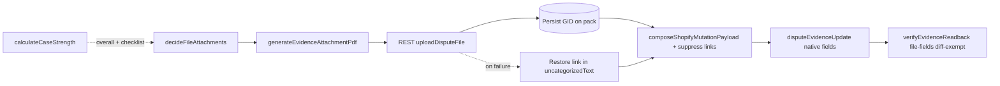

# Conditional File Evidence Layer — Implementation Plan (v2)

## Why this plan exists

**Merchant report (2026-05):** After uploading shipping documents in DisputeDesk and saving to Shopify, the **Chargeback response → Additional evidence** rows (Shipping documentation, Customer communication, etc.) often still show **Upload file** — uploads look like they vanished. They didn't: DisputeDesk hosts them and cites labelled links in `uncategorizedText` via [`formatManualAttachmentsBlock`](../../lib/shopify/manualAttachments.ts), but Shopify's named file rows stay empty because no `*File` GID was ever sent.

The cause is documented in [`lib/shopify/disputeFileUpload.ts`](../../lib/shopify/disputeFileUpload.ts) as dead-code. As of 2026-04-21:

- REST `/admin/api/{ver}/shopify_payments/disputes/:id/dispute_file_uploads.json` → **404** on 2024-10, 2025-04, 2026-01.
- GraphQL `stagedUploadsCreate` rejects `DISPUTE_FILE_UPLOAD` resource type.

Commit [`f61176c`](../../) added the new scopes (`read_shopify_payments_dispute_file_uploads`, `write_shopify_payments_dispute_file_uploads`) and a fresh probe script. **Phase 0 ran 2026-05-03 and the API path is fully green** — see `docs/.shopify-evidence/phase-0-results/`. The earlier 404 was a casing artefact (`UNCATEGORIZED_FILE` vs `uncategorized_file`), not a structural block. Phases 1–7 are now unblocked; only Phase 0c (per-tab visual UI verification by the maintainer) remains before the flag can flip on real merchants.

## Implementation status (2026-05-03)

All phases are landed. Behavior is gated by `FILE_EVIDENCE_ATTACHMENTS_ENABLED` — when off, every code path reduces to byte-identical pre-flag behaviour. End-to-end verified against a real fraud dispute on `surasvenne` (see `scripts/verify-file-evidence-rollout.ts`). Total test count: 1061 (was 1006 before this work; +55 across the new pieces). Typecheck clean, build green.

| Phase | Pieces | Status |
|---|---|---|
| 0 | Probe scripts; `lib/shopify/disputeFileUpload.ts` real helper; per-tab UI verification (FRAUDULENT only); MIME / size limits (2 MiB UI ceiling) | ✅ |
| 1 | Optional `fileEligible` boolean on `CanonicalSpec` + `isFileEligible()` helper | ✅ |
| 2 | `lib/shopify/decideFileAttachments.ts` pure planner; reason-aware filtering; **conservative slot table** (fraud-verified shape applied to all families); manual-upload heuristic so file uploads without `proofType` discriminator surface as moderate | ✅ |
| 3 | `lib/featureFlags.ts`; `lib/packs/generateEvidenceAttachmentPdf.ts` PDF facade; `composeShopifyMutationPayload` accepts `attachmentPlan`; `saveToShopifyJob` integration with REST upload + GID idempotency + audit events | ✅ |
| 4 | "Native evidence" pointer block in `uncategorizedText`; `submission-preview/route` parity (runs `decide` with placeholder GIDs) | ✅ |
| 5 | `emitSaveToShopifyEvents` extended with `nativeAttachmentCount` + `nativeAttachmentFields` on audit + dispute history | ✅ |
| 6 | EvidenceRow shows a "📎 Attached to <slot>" badge for natively-routed fields; ReviewSubmitTab renders FileEvidenceRoutingCard above ExactDataSentCard listing per-file routing | ✅ |
| 7a | Help articles `fieldMapping` + `afterSaving` (portal + embedded mirror) updated in en.json + en-US.json. Other 10 locales still describe flag-off behaviour pending re-translation | ✅ (en/en-US) |
| 7b | Workspace API surfaces `fileEvidence.{flagEnabled, scopesGranted, missingScopes}`; ReviewSubmitTab shows "Reinstall to enable native file evidence" banner when scopes are stale | ✅ |
| extra | `verifyEvidenceReadback` now diffs file fields by GID equality (Phase 0d close-out) | ✅ |
| extra | Removed link-suppression for natively-attached items: synthesised PDFs aren't duplicates of merchant uploads, so issuer now sees both (synthesised summary in *File row + original as labelled link) | ✅ |

Empirical verification of non-fraud reason families (Phase 2 follow-up) cannot be done on the available dev store (`surasvenne` only has FRAUDULENT disputes). The conservative table will need to be widened post-flag-rollout when real refund / subscription / etc. disputes occur and merchants can confirm which `*File` rows render in their Admin chargeback-response screen — narrow always, never widen speculatively.

## Phase 0 outcomes (2026-05-03)

Phase 0 ran end-to-end against `surasvenne.myshopify.com`. Captured artefacts in `docs/.shopify-evidence/phase-0-results/`. Headline:

- **REST upload:** HTTP 200 + numeric `id` on all six `document_type` values. Lowercase `snake_case` is mandatory; uppercase returns 422.
- **GraphQL acceptance:** every named `*File` field accepts the GID with empty `userErrors`. The mapping is 1:1.
- **Read-back:** all six file fields return `{ id }` in `disputeEvidence` — file fields are **fully verifiable**, not write-only. Original v2 assumption is corrected throughout this plan.
- **MIME / size:** accepted = `image/jpg`, `image/jpeg`, `image/png`, `application/pdf`. **Hard cap = 2,097,152 bytes (2 MiB)** — Admin's upload modal states "smaller than 2 MB" (Phase 0c). REST API tolerates up to ~3.81 MiB but anything in between renders inconsistently in the UI. Shopify content-sniffs (corrupt PDFs are rejected even with declared `application/pdf`).
- **No public list endpoint:** REST `GET /dispute_file_uploads.json` returns 404 — read-back must use GraphQL.
- **Reason-aware UI rendering:** Shopify's *Additional evidence* card only shows the file rows relevant to the dispute reason. For `FRAUDULENT`, `refundPolicyFile` and `cancellationPolicyFile` are accepted by the API but **not displayed** in the merchant UI. Phase 2 (`decideFileAttachments`) must filter `targetField` candidates by dispute-reason family — a hidden slot "succeeds" everywhere except where it matters.

The helper `lib/shopify/disputeFileUpload.ts` is implemented (12 unit tests in `__tests__/disputeFileUpload.test.ts`) but **not wired into `saveToShopifyJob` yet** — that's Phase 3 behind the feature flag.

**Phase 0c (visual UI verification per tab in Shopify Admin) is the only remaining Phase 0 step**: see `docs/.shopify-evidence/phase-0-results/_PENDING_0c_VISUAL_VERIFICATION.md`. Until that punch list is closed, the flag stays off in production-like settings.

## What is settled (no longer open questions)

1. **Native-only when attached.** When a file lands in a named `*File` slot, its labelled link is **removed** from `uncategorizedText`. The issuer sees one copy of the file in the right row — never the same file in two places.
2. **Pack PDF stays as a link.** The auto-generated DisputeDesk pack PDF is **not** uploaded to `uncategorizedFile`. `uncategorizedFile` is reserved as overflow capacity for `decideFileAttachments`. Pack PDF continues to ship as a labelled link in `uncategorizedText` exactly as it does today.
3. **File attachments are submission-layer only.** They never change strength, auto-save eligibility, the coverage gate, or the fatal-loss gate. A weak case with a strong-priority attachment still parks for review in review mode and still blocks in auto mode.
4. **Native + link is never both.** Restated for clarity: any file with a confirmed GID in a named slot is excluded from the link block in `uncategorizedText`. If upload fails, the file falls back into the link block with no native attachment.

## Architectural principles

- **Surgical:** decision-driven amplification only — not a general file manager.
- **Single policy brain:** all dynamic rules (payload reads, priorities, slot choice, overflow, weak-case gating) live in [`lib/shopify/decideFileAttachments.ts`](../../lib/shopify/decideFileAttachments.ts).
- **Minimal registry:** [`canonicalEvidence.ts`](../../lib/argument/canonicalEvidence.ts) may expose at most an optional **static `fileEligible: boolean`** per field. **No** `fileAttachmentHints`, **no** dynamic upgrade logic in the registry.
- **Strength is read-only:** [`calculateCaseStrength`](../../lib/argument/caseStrength.ts) is untouched.

## The six file slots (locked from real schema)

[`DisputeEvidenceUpdateInput`](../../lib/shopify/mutations/disputeEvidenceUpdate.ts) exposes exactly six file fields. The plan's enum is closed:

```ts
type NamedFileField =
  | "cancellationPolicyFile"
  | "customerCommunicationFile"
  | "refundPolicyFile"
  | "shippingDocumentationFile"
  | "uncategorizedFile"
  | "serviceDocumentationFile";
```

`decideFileAttachments` returns this exact string set; `saveToShopifyJob` switches on it exhaustively (TS exhaustiveness check, no `default` branch). No "etc." anywhere in code.

## Decision policy (v1)

| `overall` (case strength) | Attach? |
|---------------------------|---------|
| `strong` | **No** |
| `moderate` | Yes — qualifying candidates only; max 2 native attachments |
| `weak` | Yes **only if** ≥1 candidate has `priority === "strong"`; max 2 native attachments |
| `insufficient` | No |

**Discipline (always):**

- Max **2** native attachments per case (Shopify slots populated).
- No supporting-only attachments; no product description / order confirmation / generic policy files.
- No negative or contradictory signals (reuse bank-safety patterns; policy in `decide`, not scoring).
- `decide` does **not** bypass coverage / fatal-loss / auto-save gates — those run first; if they say block/park, file plan is irrelevant.

**Deterministic overflow rule:**

When two candidates resolve to the same `targetField`:

1. Higher `priority` wins the named slot (`strong` > `moderate`); ties broken by candidate order.
2. Loser is reassigned to `uncategorizedFile` **if and only if** that slot is free in the current plan.
3. Otherwise loser is dropped from the native attachment plan and falls into the link block in `uncategorizedText`.
4. Pack PDF is **never** assigned to `uncategorizedFile` — that slot belongs to overflow.

## Decision output shape

```ts
type FileAttachmentPlanEntry = {
  evidenceFieldKey: string;          // e.g. "delivery_proof"
  attachmentType: string;            // PDF layout key, e.g. "delivery"
  priority: "strong" | "moderate";
  reason: string;                    // human-readable; powers Review & Submit + audit
  resolvedSlot:
    | { kind: "native"; targetField: NamedFileField; origin: "primary" | "overflow" }
    | { kind: "link";   fallbackReason: "no_slot_available" | "policy_excluded" };
};
```

`reason` is the merchant-facing transparency string. `resolvedSlot.kind` decides whether the file goes into a native row or stays a link.

## Single PDF generator (external API)

One entry point:

`generateEvidenceAttachmentPdf({ attachmentType, evidenceFieldKey, sections, reason, shopDomain, disputeId })`

- `attachmentType` — drives **layout** (delivery / communication / service / policy / other).
- `evidenceFieldKey` — drives **content selection** (which sections / which canonical field's payload).
- Internal layout branches on `attachmentType` only; no separate exported `generateDeliveryProofPdf` / `generateCommunicationPdf` / etc.

## Execution order (mandatory)

```
decideFileAttachments(...)
  → for each entry where resolvedSlot.kind === "native":
      generateEvidenceAttachmentPdf(...)
      REST upload                                   (Shopify file API)
      persist returned GID on pack (idempotency)    (before mutation)
  → composeShopifyMutationPayload(..., attachmentPlan)
      sets *File fields with confirmed GIDs only
      suppresses link entries for natively-attached items
      pack PDF link unaffected (Q3=B)
      claim-linked text variants chosen by upload outcome
  → disputeEvidenceUpdate mutation
  → verifyEvidenceReadback (file fields are diff-exempt)
```

Do **not** generate PDFs before the slot is decided. Do **not** call the mutation before GIDs are persisted.

## Bank text integration (claim-linking)

Submitted text ties each attachment to a factual claim, not generic "see attached." Example: *"The order was delivered successfully and confirmed by the carrier. This is supported by the attached proof of delivery document."*

**Hard rule:** the "supported by attached" sentence is selected **after upload settles**, not before. Two text variants per claim — `withAttachment` and `withoutAttachment`. If REST upload fails and the file falls back to a link, the text uses the `withoutAttachment` variant. We never claim an attachment exists when it doesn't.

---

# Phase 0 — Prove the path (own PR; gate for everything else)

This is the only phase that gets work right now. Phases 1+ do not start until this PR is merged with all acceptance criteria green.

## Phase 0 acceptance criteria

### 0a. REST upload returns 200 + file id

Run [`scripts/probe-rest-file-upload.mjs`](../../scripts/probe-rest-file-upload.mjs) against the current API version with new scopes installed. Capture the **full** response — status, headers (especially `x-request-id`), body, and the returned `id` field shape.

- **Pass:** HTTP 200 + a numeric `id` (or whatever Shopify returns).
- **Fail (404):** scopes did not unlock the endpoint → entire plan parked → write up findings, return text-only.
- **Fail (403):** scope still missing or shop not re-authorized → fix scope wiring, re-probe.
- **Fail (5xx):** transient — retry with backoff before concluding.

### 0b. GraphQL accepts the GID on each named file field

For each of the six fields, run a `disputeEvidenceUpdate` mutation with the resulting `gid://shopify/ShopifyPaymentsDisputeFileUpload/{id}`. Capture `userErrors` per field.

- **Pass:** all six fields accept the GID with empty `userErrors`.
- **Partial:** narrow the slot list to whatever works; revise the closed enum and document.
- **Fail (all):** plan parked.

### 0c. Per-tab visual UI verification (NEW per maintainer request)

For each field where 0a + 0b passed: open the merchant's **Shopify Admin → Payments → Chargeback response** screen and **visually confirm**:

- The matching row populates with the uploaded file name (e.g. `shippingDocumentationFile` → "Shipping documentation" row).
- A download icon is present and the served file matches what we sent (byte-equal or content-equal — open it and read it).
- The row state changes from "Upload file" to populated.
- No error banner, no "Processing" stuck state.

**Required artefacts** in `docs/.shopify-evidence/phase-0-results/`:

- One screenshot per field showing the populated row.
- Field-vs-row mapping table (which `*File` drives which UI row in the Admin layout).
- Any field where API succeeds but UI does not render — flag for narrowing the slot list.

This is the truth check. API success without UI population means the merchant still sees empty rows and the work was wasted.

### 0d. Read-back behavior per file field — **REVISED**

Phase 0 probe (2026-05-03) showed file fields are **NOT write-only**. The GraphQL `dispute → disputeEvidence → *File { id }` query returns the same GIDs we set, on all six fields. This is an upgrade over the original assumption: file fields can be **diff-included with GID-equality matching**, giving stronger verification than text fields (text fields use non-empty heuristic; file fields can be exact-match).

Phase 0 itself does not modify [`verifyEvidenceReadback`](../../lib/shopify/verifyEvidenceReadback.ts) — the existing query covers text fields, the existing diff covers existing inputKeys, and `saveToShopifyJob` still doesn't send file fields (flag off). When Phase 3 wires production sends:

- Add the six `*File { id }` selections to `VERIFY_EVIDENCE_QUERY`.
- Add a separate `FILE_FIELDS` set classified by **GID equality** against `inputKeys[fieldName].id`.
- File-field input keys classify as `confirmed` if read-back GID matches, `missing` otherwise (real `verified: false`, not a false alarm).
- Verification status flow (`saved_to_shopify_unverified` → `saved_to_shopify_verified`) now depends on text **and** file fields.

The original "diff-exempt / write-only" rule is **abandoned**.

### 0e. MIME + size limits

Empirically test: small PDF, large PDF, image (PNG/JPEG), corrupt PDF, oversized PDF. Capture:

- Accepted MIME types per field.
- Maximum file size (and how Shopify rejects oversized).
- Whether image fields exist or all six accept PDF.

Update [`docs/technical.md`](../technical.md) § *File evidence path*.

## Phase 0 deliverables

- [`scripts/probe-rest-file-upload.mjs`](../../scripts/probe-rest-file-upload.mjs) — captured success run, output committed to `docs/.shopify-evidence/`.
- [`lib/shopify/disputeFileUpload.ts`](../../lib/shopify/disputeFileUpload.ts) — rewritten as a **real** helper (not a dead stub). Single export: `uploadDisputeFile({ session, disputeId, file, mimeType, fileName }) → { id, gid }`. Includes `x-request-id` propagation for failure logging.
- [`lib/shopify/verifyEvidenceReadback.ts`](../../lib/shopify/verifyEvidenceReadback.ts) — file fields diff-exempt.
- `docs/.shopify-evidence/phase-0-results/` — probe output, six per-field screenshots, MIME/size table, read-back behavior table, field-vs-row mapping.
- [`docs/technical.md`](../technical.md) updated.
- **No production wiring** — `saveToShopifyJob` is unchanged; flag is unwired; nothing user-visible. The helper is callable but called from nowhere except tests.

## Phase 0 fail modes (and what they mean)

- **REST still 404 with new scopes:** file uploads remain impossible from public apps. Plan parked. Help / docs already explain link-in-text — no change needed. Maintainer reports findings.
- **REST 200 but GraphQL rejects all 6 GIDs:** GID format mismatch — re-introspect input type, fix builder, re-probe. If still fails after fix, plan parked.
- **Some fields work, others don't:** narrow the closed enum to working fields. Revise overflow rule if `uncategorizedFile` is among the rejected fields (overflow capacity disappears).
- **API works but UI doesn't populate:** dual-API gap — probably Shopify-internal. Document and decide whether merchants benefit from API-only attachment (probably not — the whole point is filling those native rows). Plan likely parked or scoped down.

---

# Phase 1 — Registry (minimal)

Optional `fileEligible: boolean` on [`CanonicalSpec`](../../lib/argument/canonicalEvidence.ts). Static allow/deny only. Tests cover the static flag — **not** attachment priority (that lives in `decide`).

# Phase 2 — `decideFileAttachments.ts`

Pure function (no I/O). Inputs: case strength, checklist, sections / payload accessors, dispute reason, coverage / fatal-loss flags. Outputs: `FileAttachmentPlanEntry[]` per the shape above.

**Reason-aware slot filtering (Phase 0c finding):** before any policy decision, `decide` must compute the **set of `targetField` slots that will actually render in Admin UI for this dispute's reason**. Shopify's chargeback response form hides slots that aren't relevant — e.g. for `FRAUDULENT`, `refundPolicyFile` and `cancellationPolicyFile` are accepted by the API but never display. A hidden slot would consume a native attachment but produce no merchant- or issuer-visible benefit, so it must be excluded as a candidate. Suggested mapping (key off `DISPUTE_REASON_FAMILIES` from `lib/argument/disputeReason.ts` or equivalent):

| Reason family | Visible `*File` slots |
|---|---|
| Fraud (`FRAUDULENT`, `UNRECOGNIZED`) | `customerCommunicationFile`, `shippingDocumentationFile`, `serviceDocumentationFile`, `uncategorizedFile` |
| Fulfillment (`PRODUCT_NOT_RECEIVED`) | as Fraud |
| Quality (`PRODUCT_UNACCEPTABLE`) | as Fraud + `serviceDocumentationFile` (already in set) |
| Refund (`CREDIT_NOT_PROCESSED`) | + `refundPolicyFile` |
| Subscription (`SUBSCRIPTION_CANCELED`) | + `cancellationPolicyFile`, `refundPolicyFile` |
| Duplicate (`DUPLICATE`) | as Fraud |

Phase 2 must finalise this table by re-probing one dispute per family before shipping (Phase 0c only verified `FRAUDULENT`). If a family disagrees with the table, narrow the family's slot set; never widen it.

**Tests:**

- `strong` → empty plan.
- `moderate` with one candidate → 1 native.
- `moderate` with three candidates → 2 native (max-2 cap).
- `weak` with no strong-priority candidate → empty plan.
- `weak` with one strong-priority + one moderate → 1 native (the strong) + 0 (weak rule excludes the moderate when stand-alone).
- `insufficient` → empty plan.
- Two candidates, same `targetField`, both `strong` → first native (primary), second native (overflow → `uncategorizedFile`).
- Three candidates, two on same `targetField`, third on `uncategorizedFile` directly → first native (primary), second drops to link (overflow slot taken by third).
- Coverage gate active → empty plan (file plan does not bypass).
- Fatal-loss gate active → empty plan (file plan does not bypass).
- **Reason-hidden slot filtering:** for `FRAUDULENT`, a candidate targeting `refundPolicyFile` is **dropped** (not assigned to overflow) because the slot is hidden by Shopify on this reason. For `SUBSCRIPTION_CANCELED`, the same candidate is allowed.

# Phase 3 — Upload helper integration + job wiring

- Promote `uploadDisputeFile` (built in Phase 0) into the production submission path.
- [`saveToShopifyJob`](../../lib/jobs/handlers/saveToShopifyJob.ts):
  - Flag **off** → unchanged (text + links).
  - Flag **on**:
    1. `decideFileAttachments(...)` → plan.
    2. For each `kind: "native"` entry: `generateEvidenceAttachmentPdf` → `uploadDisputeFile` → **persist GID on pack** (`pack_json.attachments[].uploadedGid`, plus filename, slot, evidenceFieldKey, uploaded_at) **before** the mutation call.
    3. **Idempotency on retry:** if a plan entry already has a persisted `uploadedGid` and it is fresh (TTL per Phase 0 findings; default "until pack finalized" if no Shopify expiry), skip re-upload and reuse the GID.
    4. Compose mutation via `composeShopifyMutationPayload(..., attachmentPlan)` — see Phase 4.
    5. Run mutation.
    6. On any single upload failure: drop **only that entry** from the native plan, restore its link in the link block, audit `attachment_skipped` with `x-request-id` and `evidenceFieldKey`. Continue with the rest of the plan.
    7. On total upload failure: omit all file fields, full link block as today, audit `attachment_skipped_all`. **Mutation must still succeed** — file failure never blocks save.

- Audit events (in `pack_events` / job audit): `attachment_count`, `fields_attempted`, `upload_failures`, `slot_overflow`, `link_fallback`, all with `x-request-id` when present.

# Phase 4 — Compose, preview, claim-linking

- [`composeShopifyMutationPayload`](../../lib/shopify/composeShopifyMutationPayload.ts) gains an `attachmentPlan: FileAttachmentPlanEntry[]` input.
  - For each plan entry with `kind: "native"` and a confirmed GID, set the corresponding `*File` field on the input.
  - Build the link block with `manualAttachments` filtered: any `evidence_item_id` present in the plan as `kind: "native"` is **excluded**. Pack PDF link is included unconditionally (Q3=B).
  - Function remains pure — same inputs → same output, byte-equivalent.
- [`buildEvidenceForShopify`](../../lib/shopify/formatEvidenceForShopify.ts): claim-linked sentence variants per evidence field. Variant selection takes the `attachmentPlan` and uses `withAttachment` only when the plan entry has a confirmed GID.
- [`submission-preview`](../../app/api/packs/[packId]/submission-preview/route.ts): runs the same `decideFileAttachments` + `composeShopifyMutationPayload` (placeholder GIDs OK — they exercise the plan shape, not real upload). Add a parity test asserting preview output equals job output (modulo URL tokens) for fixed fixtures.

# Phase 5 — Persistence + metrics

- Last attachment plan stored on `evidence_packs` (e.g. `pack_json.attachmentPlan`): resolved slots, reasons, filenames, GIDs.
- Audit events: `attachment_count`, `fields_attempted`, `upload_failures`, `slot_overflow`, `link_fallback`.
- Optional: a dispute-history line item per native attachment so merchants can audit later.

# Phase 6 — UI transparency

- **Evidence tab:** clip icon on rows that appear in the latest plan as `kind: "native"`. Tooltip from `messages.*.json` shows `targetField` label + reason.
- **Review & Submit:** for each plan entry, a row showing:
  - File title.
  - **Where it lands:** native (with target row name) / overflow (with target row name) / link in narrative.
  - **Reason** (full string).
- **Help articles:** `messages.help.articles.fieldMapping` and `messages.help.articles.afterSaving` (and embedded mirror) refreshed to describe what merchants now see in Admin — native rows populated when flag is on, links retained for overflow / fallback / flag-off.

# Phase 7 — Rollout + QA

- **Re-install consent UX** for new scopes: in-app banner on first save attempt where the flag would attach a file, prompting reauthorization. Decide concrete trigger during Phase 0 close-out (banner now or on-flag-flip).
- `npm test`, `npx tsc --noEmit`, `npm run build`.
- E2E on a real store: dispute end-to-end with flag on; verify native rows in Admin again; verify retry-on-mutation-fail does not duplicate uploads.
- Flag rollout: dev → staging → opt-in beta merchants → general availability.
- Update [`docs/technical.md`](../technical.md) and [`docs/architecture.md`](../architecture.md) if relevant.

---

## Architecture flow



## Feature flag

`file_evidence_attachments_enabled` — default **off** until Phase 0 ships green and per-tab UI population is confirmed on at least one real store.

## Invariants (do not violate)

- **Strength is read-only:** `calculateCaseStrength` is never modified by file logic.
- **Gates are non-bypass:** file attachments do not change coverage / fatal-loss / auto-save outcomes.
- **Native or link, never both:** when a file lands natively, its link is suppressed in `uncategorizedText`.
- **Pack PDF is link-only:** `uncategorizedFile` is reserved for `decide` overflow.
- **Idempotency before mutation:** GID persisted before `disputeEvidenceUpdate` to prevent duplicate uploads on retry.
- **File fields verify by GID equality:** Phase 0 confirmed read-back returns the GIDs we sent on all six fields, so `verifyEvidenceReadback` checks `evidence[field].id === input[field].id` (not the original "diff-exempt" rule, which was based on a wrong assumption).
- **Claim-linking matches reality:** "supported by attached document" text only ships when the GID is confirmed.

## Resolved in this revision

- ~~Q2 dual representation~~ → **Native-only when attached.**
- ~~Q3 pack PDF placement~~ → **Stays as link in `uncategorizedText`; `uncategorizedFile` reserved for overflow.**
- ~~Idempotency on retry~~ → **Persist GID on pack before mutation; skip re-upload while GID is fresh.**
- ~~Same-`targetField` overflow rule~~ → **Highest priority wins named slot; loser → `uncategorizedFile` if free; else loser → link.**
- ~~`verifyEvidenceReadback` for file fields~~ → **Phase 0 proved file fields are fully readable; Phase 3 will diff them by GID equality (stronger verification than text fields, not weaker).**
- ~~Auto-save bypass concern~~ → **Explicit invariant: file plan does not change strength or gates.**
- ~~Phase 0 sequencing~~ → **Self-contained PR; no Phase 1+ work starts until merged.**
- ~~Per-tab UI population~~ → **Phase 0c: visual confirmation per field, screenshots committed.**

## Still open (decide before Phase 1 starts)

- **Reinstall consent UX trigger** — in-app banner on first save attempt that needs files, or a one-off prompt on flag flip? Decide alongside Phase 0 close-out.
- **Idempotency TTL** — Phase 0 must report whether Shopify expires dispute file uploads. If yes, set TTL accordingly. If no, default to "fresh until pack finalized."
- **Replay rule on pack edits** — if a merchant edits the pack after a partial save, do we re-upload everything or reuse stashed GIDs? Tie to `dispute_evidence_gid` lifecycle. Decide before Phase 3.
