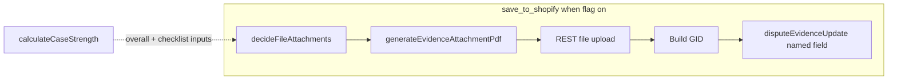

# Conditional File Evidence Layer — Implementation Plan (revised)

## Current state (constraints from code)

- **Submission path:** [`lib/jobs/handlers/saveToShopifyJob.ts`](../../lib/jobs/handlers/saveToShopifyJob.ts) builds text via [`composeShopifyMutationPayload`](../../lib/shopify/composeShopifyMutationPayload.ts) → [`buildEvidenceForShopify`](../../lib/shopify/formatEvidenceForShopify.ts), then **GraphQL** `disputeEvidenceUpdate`; **REST** supplements [`buildRestSupplementFields`](../../lib/shopify/buildRestSupplementFields.ts) (text-only columns).
- **File creation:** **GraphQL cannot upload** dispute files. **REST** is the upload path after Shopify grants `read_shopify_payments_dispute_file_uploads` and `write_shopify_payments_dispute_file_uploads` (in addition to existing evidence mutation scope).
- **Attachment wiring:** [`DisputeEvidenceUpdateInput`](../../lib/shopify/mutations/disputeEvidenceUpdate.ts) uses **fixed named file fields** (`shippingDocumentationFile`, `customerCommunicationFile`, `serviceDocumentationFile`, `uncategorizedFile`, etc.) — not a free-form `files` array.
- **Historical note:** [`lib/shopify/disputeFileUpload.ts`](../../lib/shopify/disputeFileUpload.ts) documented 404s before these scopes; Phase 0 must **re-prove** E2E on a real store.
- **Strength:** [`calculateCaseStrength`](../../lib/argument/caseStrength.ts) **must not change**. File attachments are **submission-layer only**.

## Architectural principles

- **Surgical:** Decision-driven amplification only — not a general file manager.
- **Single policy brain:** All dynamic rules (payload reads, priorities, slot choice, weak-case gating) live in **[`lib/shopify/decideFileAttachments.ts`](../../lib/shopify/decideFileAttachments.ts)**.
- **Minimal registry:** [`canonicalEvidence.ts`](../../lib/argument/canonicalEvidence.ts) may expose at most an optional **static `fileEligible` boolean** per field. **No** `fileAttachmentHints`, **no** dynamic upgrade logic in the registry.

## Decision output shape (conceptual)

```text
[
  {
    evidenceFieldKey: "delivery_proof",
    targetField: "shippingDocumentationFile",
    attachmentType: "delivery",
    priority: "strong" | "moderate",
    reason: "Human-readable why this attachment is included (UI + audit)"
  }
]
```

`targetField` is **final before** PDF generation. `reason` powers **Review & Submit** transparency.

## Decision policy (v1)

| `overall` (case strength) | Attach? |
|---------------------------|---------|
| `strong` | **No** |
| `moderate` | Yes — qualifying candidates only; max 2 |
| `weak` | Yes **only if** ≥1 candidate with **`priority === "strong"`**; max 2 |
| `insufficient` | No |

**Discipline (always):**

- Max **2** files per case.
- No supporting-only attachments; no product description / order confirmation / generic policy files.
- No negative or contradictory signals (reuse bank-safety patterns; policy in `decide`, not scoring).
- No “upload everything” behavior.

**Selection:** After strength gates, filter Eligible × policy; sort by priority (`strong` > `moderate`); enforce **one mutation field per `targetField`** or explicit overflow rule (confirm Shopify allows only one file per named field in Phase 0); dedupe by signal/category as needed; cap at 2.

## Execution order (mandatory)

**`decideFileAttachments` → `targetField` known → `generateEvidenceAttachmentPdf({...})` → REST upload → id → `gid://shopify/ShopifyPaymentsDisputeFileUpload/{id}` → set on correct **`disputeEvidenceUpdate` key → mutation.**

Do **not** generate before the Shopify slot is decided.

## Single PDF generator (external API)

One entry point:

`generateEvidenceAttachmentPdf({ attachmentType, evidenceFieldKey, sections, reason, shopDomain, disputeId })`

Internal layout branches on `attachmentType` only; no separate exported `generateDeliveryProofPdf` / `generateCommunicationPdf` / etc.

## Bank text integration

Submitted text must **tie each attachment to a factual claim**, not generic “see attached.”

Example pattern: *“The order was delivered successfully and confirmed by the carrier. This is supported by the attached proof of delivery document.”*

## Phase 0 — Acceptance gate (full chain)

Must pass before enabling `file_evidence_attachments_enabled` broadly:

1. **Scopes** on app + merchant re-authorization if needed.
2. **REST:** Upload returns file **id**.
3. **GID:** `gid://shopify/ShopifyPaymentsDisputeFileUpload/{id}` is accepted by **`disputeEvidenceUpdate`** on each **named file field** intended for v1 (smoke at least one dispute per field class you ship).
4. **Verification:** Read-back behavior documented; file fields treated so **no false failure alarms** (extend write-only / diff rules in [`verifyEvidenceReadback.ts`](../../lib/shopify/verifyEvidenceReadback.ts) accordingly).
5. **MIME/size limits:** Empirically confirmed; document in [`docs/technical.md`](../technical.md).

## Phase 1 — Registry (minimal)

Optional `fileEligible: boolean` on [`CanonicalSpec`](../../lib/argument/canonicalEvidence.ts) for static allow/deny. Tests only for static flags — **not** for attachment priority (that belongs in `decide` tests).

## Phase 2 — `decideFileAttachments.ts`

Pure function (no I/O): inputs include case strength, checklist, sections/payload access, dispute reason, coverage/fatal flags if relevant to “should we attach at all.” Unit tests for moderate vs weak-strong-only vs strong-none, max 2, exclusions.

## Phase 3 — Upload helper + job wiring

- Implement REST upload in [`disputeFileUpload.ts`](../../lib/shopify/disputeFileUpload.ts) (replace dead stub only after Phase 0 green).
- **`saveToShopifyJob`:** When `file_evidence_attachments_enabled`, run pipeline order above.
- **Fallback:** If upload fails — log (**`x-request-id`** when present), **omit all file fields**, continue **text-only**; **do not** fail save unless GraphQL text mutation fails. **Audit** that file attachment was skipped.

## Phase 4 — Compose, preview, verification

- Extend [`composeShopifyMutationPayload`](../../lib/shopify/composeShopifyMutationPayload.ts) inputs for named file fields; preserve purity.
- [`buildEvidenceForShopify`](../../lib/shopify/formatEvidenceForShopify.ts): claim-linked sentences coordinated with attachment plan.
- [`submission-preview`](../../app/api/packs/[packId]/submission-preview/route.ts): same `decide` + planned list (**labels, targetField, reason**; no real GIDs required).

## Phase 5 — Persistence + metrics

- Store last attachment **decision** (field keys, `targetField`, `reason`, optional filenames) for UI/history.
- Audit / job events: attachment count, fields attempted, upload failures.

## Phase 6 — UI transparency

- **Evidence tab:** Clip icon on rows included in plan; tooltip from [`messages`](../../messages/en.json).
- **Review & Submit:** For each file: **title** + **Reason:** (full `reason` string) — transparency vs black-box competitors.

## Phase 7 — Docs + QA

- Update [`docs/technical.md`](../technical.md): policy summary, REST+GraphQL flow, fallback, verification, flag.
- Run **`npm test`**, **`npx tsc --noEmit`**, **`npm run build`**; extend snapshot tests as needed.

## Architecture flow



## Feature flag

- **`file_evidence_attachments_enabled`** — default **off** until Phase 0 completes on a dev/prod-like store.

## Open questions / Shopify risks

- **One file per named field?** If only one, `decide` must not emit two rows with the same `targetField` without an explicit overflow slot (e.g. `uncategorizedFile`).
- **MIME/type expectations** per Shopify field (PDF vs image).
- **Orphan uploads** on retry — idempotency and cleanup policy.
- **Scope rollout** — reinstall / consent UX when enabling new read/write file upload scopes.
