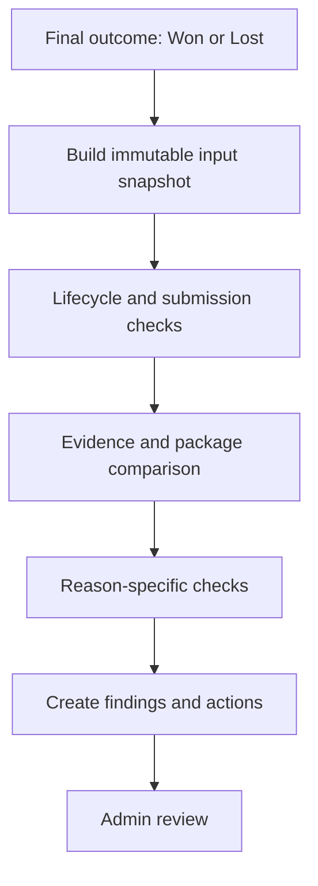
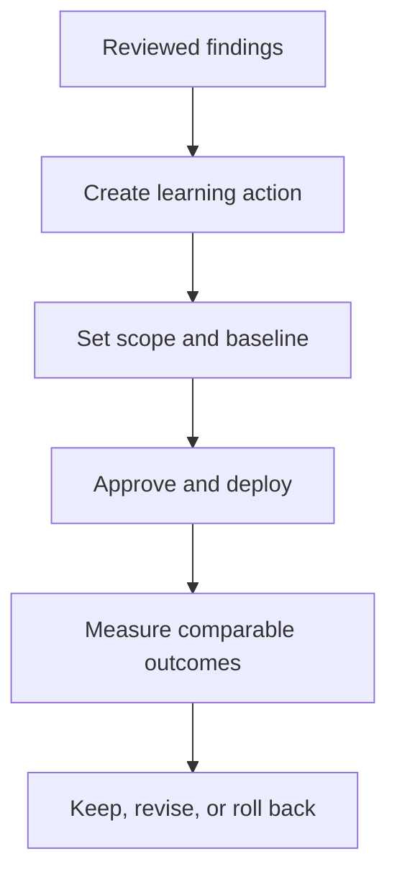

# DisputeDesk — Post-outcome evidence analysis and Admin Outcome Analysis page

**Status:** PLAN — Phase 0 data-readiness audit COMPLETE (2026-08-30, prod). No implementation yet.
**Feature:** Post-outcome evidence analysis and comparable-cohort benchmarking
**Primary surface:** Internal Admin → Outcome Analysis
**Initial deep-analysis scope:** PRODUCT_UNACCEPTABLE — **contradicted by the Phase 0 audit, see §25**
**Default admin period:** Last 90 days

> **Read §25 first.** The Phase 0 audit measured the production record against this plan's
> assumptions. Three of them do not hold. §§1–24 are the original specification, preserved
> intact; §25 records what the data actually supports and which scope decisions must change
> before implementation starts.

---

## 1. Executive decision

Build one versioned, auditable post-outcome analysis for every eligible decided dispute
(won or lost) and expose the results on a dedicated internal admin page.

The feature answers:

> Based on the exact information and package DisputeDesk had when evidence was submitted,
> which evidence configurations, reasoning patterns, mapping choices, presentation choices,
> or lifecycle events were present in this decided case, and what product or merchant
> learning should follow?

It does **not** answer:

> Why did the issuing bank reject this case?

Shopify normally gives DisputeDesk the outcome, not the adjudicator's reasoning. Therefore
the analysis may identify an **observed gap** or a **plausible improvement opportunity**, but
it must never present an inferred gap as the bank's stated reason for the loss.

## 2. Goals

- Convert retained won- and lost-case evidence into actionable product learning.
- Distinguish evidence that was **unavailable** from evidence DisputeDesk **possessed but omitted**.
- Detect incorrect, unsupported, or off-scope assertions in the submitted package.
- Detect lifecycle and submission failures without confusing `saved_to_shopify` with confirmed submission.
- Show findings across merchants on an internal admin page designed for product improvement,
  not merchant case operations.
- Allow authorized admins to confirm, edit, reject, or mark an analysis indeterminate.
- Produce structured findings that can later inform evidence acquisition, rule-engine changes,
  templates, and carefully calibrated case strength.
- Keep payment provider separate from card network and prevent outcome comparisons when
  DisputeDesk lacks equivalent provider-side case access.
- Support merchant-specific analysis against a valid comparable benchmark and, when explicitly
  selected by an admin, a comparable merchant.
- Convert reviewed findings into scoped, versioned learning actions and measure their later
  outcomes without treating correlation as causation.

## 3. Non-goals

This MVP will not:

- Modify submitted evidence or reopen a decided dispute.
- Contact customers or merchants.
- Automatically change case-strength weights, network rules, or package templates.
- Claim that an observed gap caused the bank's decision.
- Train a predictive model from unreviewed outcomes.
- Generalize outcomes across payment providers, or treat a payment provider as a card network.
- Redesign the existing merchant dashboard or Review and Forward/Evidence pages.
- Turn the Admin Overview into a case-triage surface.
- Query Shopify live from the admin UI.
- Analyze ongoing disputes as losses.
- Publish merchant rankings or expose one merchant's identifiable data to another merchant.
- Treat an all-platform average as a valid benchmark when the underlying providers, access
  levels, niches, or dispute contexts differ.

The MVP may prepare and approve a learning action, but deployment into production rules or
templates remains an explicit, authorized step.

## 4. Scope decision

### 4.1 Framework coverage

Ingest all disputes with `final_outcome IN ('won','lost')` so successful evidence
configurations and integrity defects are visible alongside gaps in lost cases.

### 4.2 Initial deep-analysis coverage

Reason-specific evidence analysis in the MVP supports **PRODUCT_UNACCEPTABLE** only.

> **SUPERSEDED by §25.3.** Production contains exactly **one** decided PRODUCT_UNACCEPTABLE
> dispute with a submitted package (a loss; zero wins). The first reason module must be
> **FRAUDULENT**, which holds 47 of the 50 analyzable cases.

Other decided reasons receive:

- Lifecycle/submission analysis.
- Source-snapshot completeness analysis.
- Submitted-package integrity analysis when deterministic checks are available.
- `reason_specific_status = 'not_yet_supported'` rather than guessed reason-specific findings.

A supported reason additionally yields `reason_specific_status = 'not_reconstructable'` when the
facts its matrix depends on are absent from the submission-time snapshot. Concretely: the single
PRODUCT_UNACCEPTABLE loss stays `NOT_RECONSTRUCTABLE` unless the buyer's actual allegation and the
return/defect facts are available — the listing alone proves what was promised, never what was
delivered (§7 Stage 5).

This keeps the first implementation honest and useful while establishing a reusable framework
for later reason modules.

### 4.3 Payment provider is a mandatory analytical dimension

The analyzer must treat payment provider, card network, and dispute reason as separate fields:

```
payment_provider → SHOPIFY_PAYMENTS | KLARNA | PAYPAL | OTHER | UNKNOWN
card_network     → VISA | MASTERCARD | AMEX | DISCOVER | OTHER | UNKNOWN
reason           → Shopify/provider reason plus network reason code when available
```

`payment_provider` identifies the system that owns or exposes the dispute workflow.
`card_network` identifies the underlying network only when DisputeDesk can determine it
reliably. Neither may be inferred from the other.

Every analysis snapshot must also capture a **provider-access profile**:

| Capability | Meaning |
|---|---|
| `claim_detail_access` | DisputeDesk can retrieve the buyer/provider's specific allegation |
| `provider_evidence_read_access` | DisputeDesk can retrieve the provider-side evidence record |
| `provider_evidence_write_access` | DisputeDesk can write/update evidence through the provider |
| `platform_save_confirmation` | The platform confirmed the evidence was **stored and read back**. Storage only — proves nothing about forwarding. |
| `submission_confirmation_access` | DisputeDesk can prove **what and when the provider forwarded to the issuer/network** |
| `outcome_access` | DisputeDesk receives a reliable final outcome |
| `adjudication_reason_access` | DisputeDesk receives the provider/adjudicator's decision rationale |

**`platform_save_confirmation` and `submission_confirmation_access` are separate capabilities and
must never be collapsed.** A save confirmation proves DisputeDesk attached evidence to the
platform and verified the readback. It does not prove the platform forwarded that evidence to the
issuer or the card network. Conflating them would let the analyzer learn "effective evidence
configurations" from packages the network never saw. See §25.4 for the production rows that make
this concrete.

Signal-by-signal, for Shopify Payments:

| Signal | Proves |
|---|---|
| `shopify_response.verified = true` (with `finalStatus = saved_to_shopify_verified`, `evidenceGid`, `fileGid`) | Shopify evidence save/readback confirmed — **storage only** |
| `submission_state = saved_to_shopify` | Evidence stored in Shopify, **not yet forwarded** |
| `submission_state = submitted_confirmed` + trusted `submitted_at` | Shopify reported **forwarding** the evidence |
| `manual_submission_reported` | Merchant assertion only; **not** provider confirmation |
| `defence_packages.status = 'submitted'` | Package submitted **to Shopify**, not necessarily to the network |

A trusted `submitted_at` derived from Shopify's `evidenceSentOn` is sufficient forwarding
confirmation. The absence of a `submission_logs` row is **not** disqualifying — the timestamp's
provenance matters more than a separate log ID.

Derive an overall access level:

```
FULL_CASE_FILE | PARTIAL_CASE_FILE | OUTCOME_ONLY | NO_PROVIDER_CASE_ACCESS | UNKNOWN
```

Expected treatment until connector capabilities prove otherwise:

- **Shopify Payments** — **`PARTIAL_CASE_FILE` at the provider level**, permanently, regardless of
  how good the save confirmation is. Use the Shopify dispute/evidence lifecycle actually received,
  but still record missing buyer narrative or adjudication detail explicitly. `shopify_response`
  grants `platform_save_confirmation`, never `submission_confirmation_access`; the latter comes
  only from `submitted_confirmed` + a trusted `evidenceSentOn`-derived `submitted_at`.
- **Klarna** — no independent case-file/evidence access unless a future connector proves
  otherwise. Historical outcomes may be visible, but evidence-effectiveness analysis must be
  limited accordingly.
- **PayPal** — no independent case-file/evidence access unless a future connector proves
  otherwise. Historical outcomes may be visible, but evidence-effectiveness analysis must be
  limited accordingly.

These are capability defaults, not permanent provider claims. The snapshot must record what
was actually accessible for that merchant and case.

### 4.4 Provider-gated analysis levels

| Analysis level | Minimum source coverage | Permitted output |
|---|---|---|
| `FULL_POST_OUTCOME` | All four gate conditions below | Full evidence/configuration/integrity analysis |
| `PACKAGE_INTEGRITY_ONLY` | Exact package available but **no forwarding confirmation** (save confirmation alone), or provider evidence record incomplete | Package assertions, internal evidence use, and limitations |
| `OUTCOME_METADATA_ONLY` | Reliable outcome but no provider case file/package | Counts and outcome segmentation only; no evidence-effectiveness conclusion |
| `NOT_ANALYZABLE` | Outcome/provider identity unreliable | Data-quality finding only |

**A case reaches `FULL_POST_OUTCOME` only when all four hold:**

1. The **exact package is reconstructable** (frozen package record, hash, and content).
2. The package **can be associated with the saved platform evidence** (e.g.
   `shopify_response.evidenceGid` ties to `disputes.dispute_evidence_gid`).
3. **Forwarding confirmation exists** — `submitted_confirmed` plus a trusted, platform-originated
   `submitted_at`. Save/readback confirmation alone does **not** satisfy this.
4. The **outcome is reliable**.

Explicit downgrades:

- `shopify_response.verified = true` **without** forwarding confirmation → `PACKAGE_INTEGRITY_ONLY`.
- `submitted_at` exists but the **package/version cannot be tied to the submission** (e.g. several
  submitted packages on one dispute, none identifiable as the forwarded one) → record a
  **data-integrity limitation**, not full analysis. This is a `DATA_INTEGRITY_FAILURE` finding
  (§8), not a silent promotion to `FULL_POST_OUTCOME`.
- Klarna and PayPal remain restricted to outcome-only or package-integrity analysis unless a real
  provider connector supplies their case records.

Klarna, PayPal, Shopify Payments, and other-provider cases must never enter the same
evidence-effectiveness cohort unless provider **and** access level are both equivalent.

### 4.5 Merchant niche is a controlled comparison dimension

Merchant benchmarking requires a controlled internal `merchant_niche`, for example
`HOME_AND_GARDEN`, `APPAREL`, `BEAUTY_AND_WELLNESS`, or `OTHER_REVIEWED`. The niche must come
from an existing merchant profile or an authorized manual classification; it must **not** be
inferred from the payment provider or a single disputed product.

Store the classification source, reviewer, timestamp, and confidence. `UNKNOWN` merchants may
be analyzed individually but must not enter a niche benchmark or pairwise comparison until
classified.

This classification is an analytical attribute, not merchant-facing copy. Changing it affects
future cohorts and creates a new classification history entry; it does not rewrite historical
analysis snapshots.

## 5. Core analytical principle: reconstruct the submission-time truth

The analyzer must operate on an **immutable snapshot of what existed when the package was
submitted**, not current mutable state. The input snapshot must distinguish:

- **Available before submission** — evidence DisputeDesk had and could have used.
- **Included in the submitted package** — evidence actually sent.
- **Available but omitted** — present before submission, absent from the submitted package.
- **Unavailable before submission** — not present in DisputeDesk at submission time.
- **Arrived after submission** — obtained later; useful for future process improvement but not
  evidence of an omission in the original package.
- **Unknown availability** — the system cannot reliably reconstruct whether it existed.

Current Gorgias messages, current product pages, revised policies, late carrier records, or
regenerated packages must never silently replace the historical state.

## 6. Eligibility and trigger

### 6.1 Eligible decided outcome

Create an analysis when:

- `final_outcome IN ('won','lost')` is confirmed.
- The dispute has a stable internal and Shopify identity.
- The outcome transition is committed.
- No completed analysis exists for the same dispute, analyzer version, and source-snapshot hash.
- The payment provider and provider-access level can be snapshotted, even if the result is
  `UNKNOWN` or `NO_PROVIDER_CASE_ACCESS`.

### 6.2 Submission branches

| Submission state | Analysis treatment |
|---|---|
| `submitted_confirmed` + trusted platform-originated `submitted_at` | Full analysis when the §4.4 gate's other three conditions hold |
| `saved_to_shopify` only — **including when `shopify_response.verified = true`** | Do **not** call it submitted. `PACKAGE_INTEGRITY_ONLY`; analyze as a possible lifecycle/procedural gap |
| `submitted_at` present but package/version not tied to the submission | Data-integrity limitation; not full analysis |
| `manual_submission_reported` only | Merchant assertion; not provider confirmation. Never `FULL_POST_OUTCOME` |
| No saved/submitted package | Lifecycle/procedural or metadata-only analysis, depending on provider access |
| Submission state contradictory | Mark `DATA_INTEGRITY_BLOCKED` and require admin review |

The analyzer must never infer confirmed transmission from a package being saved to Shopify, and
must never treat `defence_packages.status = 'submitted'` as network forwarding — that status means
submitted *to Shopify*.

### 6.3 Trigger paths

- Event/job triggered by the reliable transition to `final_outcome IN ('won','lost')`.
- Backfill job for historical decided outcomes.
- Explicit admin rerun **only** when a new analyzer version is deployed or a source-data
  integrity problem has been repaired.

## 7. Analysis pipeline



### Stage 1 — Build immutable input snapshot

Capture or resolve: dispute identity, merchant, phase, type, amount, currency, and initiated
date; Shopify reason and network reason code as known at submission; card network when
reliably known; exact final outcome and finalization time; payment provider and
provider-account/integration identity when available; provider-access profile and derived
analysis level; evidence deadline; provider-specific confirmed submission state and timestamp,
when accessible; exact submitted package record, PDF bytes, and SHA-256; package
generator/template version; case assessment and `caseStrength` at submission (canonical
`strong | moderate | weak | not_assessed`); evidence facts and their approval/state as of
submission; Gorgias evidence state and approved immutable passages as of submission; product,
order, fulfillment, return, refund, replacement, and carrier facts available as of submission;
job and lifecycle events relevant to evidence creation, saving, rebuilding, and submission;
evidence that arrived after submission, stored in a **separate** late-evidence section.

Store the normalized snapshot as an immutable artifact and retain its hash.

### Stage 2 — Lifecycle and submission checks

Deterministically test:

- Was evidence confirmed submitted?
- Was it merely saved to Shopify?
- Was the expected final package the package actually attached at submission?
- Was a later approved evidence change left out because the package was not regenerated?
- Was evidence created or approved before the deadline but not included?
- Did a queued/running/failed job prevent the expected package from being saved?
- Did the case transition through contradictory lifecycle states?
- Was the package generated after evidence submission, making it irrelevant to the bank decision?
- Is the outcome or submission timeline too incomplete to analyze reliably?
- Does the provider-access profile permit the proposed analysis level?
- Is a provider-owned evidence/submission record absent because DisputeDesk lacks connector
  access rather than because no evidence existed?

### Stage 3 — Evidence inventory comparison

For each evidence item, compute: source and provenance; availability time; approval state at
submission; whether it was eligible for inclusion; whether it appears in the exact submitted
package; whether it was represented accurately; whether it was duplicated or given
inappropriate prominence. Classify each evidence item as:

```
INCLUDED_ACCURATELY | INCLUDED_INACCURATELY | AVAILABLE_BUT_OMITTED
AVAILABLE_BUT_NOT_APPROVED | PENDING_AND_CORRECTLY_EXCLUDED | ARRIVED_AFTER_SUBMISSION
UNAVAILABLE | AVAILABILITY_UNKNOWN | IRRELEVANT_TO_REASON
```

Pending communication evidence must never be counted as omitted. Only approved,
inclusion-eligible evidence available before submission can be `AVAILABLE_BUT_OMITTED`.

### Stage 4 — Assertion and rule integrity

Inspect the structured narrative source and the rendered submitted PDF. For each material
assertion, determine where possible: supporting evidence source; evidence timestamp and status;
network and reason-code relevance; rule identifier and version, if the statement is rule-based;
whether the evidence actually satisfies the assertion; whether the assertion appears in the
exact submitted PDF. Classify assertions as:

```
SUPPORTED_AND_RELEVANT | SUPPORTED_BUT_IRRELEVANT | UNSUPPORTED
CONTRADICTED_BY_EVIDENCE | OFF_SCOPE_NETWORK_RULE | OVERSTATED | NOT_MACHINE_VERIFIABLE
```

An inability to verify an assertion does not automatically mean it was false. Use
`NOT_MACHINE_VERIFIABLE` unless the record positively shows it was unsupported or contradicted.

### Stage 5 — Reason-specific evidence checks

Run this stage only for `FULL_POST_OUTCOME` or a specifically supported
`PACKAGE_INTEGRITY_ONLY` case. Do not deep-analyze an `OUTCOME_ONLY` Klarna, PayPal, or
other-provider case as though DisputeDesk possessed the provider's dispute file.

**PRODUCT_UNACCEPTABLE matrix** — retained for the later module; see §25.3 for the module that
ships first. Evaluate whether the submission-time record contained:

- **Buyer allegation** — specific allegation known; allegation reconstructed from a
  high/medium-confidence order-linked communication; only broad Shopify category known;
  customer photographs available.
- **Purchase-time representation** — purchase-time product title and variant; purchase-time
  listing text or reliable archive; images shown at purchase; disputed dimensions, materials,
  colour, components, or quality claims; applicable purchase-time return terms and disclosure.
- **Fulfilment/product identity** — exact SKU/variant fulfilment evidence; supplier or
  warehouse specification; pre-shipment/QC evidence; serial, batch, parcel weight, or other
  identity evidence where relevant.
- **Resolution and return chain** — prior customer contact; merchant response; return
  authorization, address, or label; return attempt and tracking; returned-product
  receipt/inspection; repair or replacement offer; customer acceptance, rejection, or
  non-response.
- **Narrative quality** — exact allegation stated without invention; product evidence directly
  compared with the allegation; return/resolution history presented accurately; authentication
  evidence not used as a substitute for product-quality evidence; network-specific procedural
  statements applied only when supported.

The analyzer must not conclude that a physical product matched its listing merely because the
listing exists. The listing proves what was **promised**; separate evidence is required to
prove what was **delivered** or its condition.

### Stage 6 — Outcome interpretation

**Won case** — identify evidence configurations plausibly associated with the successful
outcome; identify claim-specific strengths in the submitted package; run the same integrity
checks used for losses; surface unsupported, irrelevant, or off-scope assertions even though
the case won. Never infer that every included assertion contributed to the win.

**Lost case** — identify actionable evidence, reasoning, mapping, presentation, or lifecycle
gaps; distinguish unavailable evidence from evidence available but omitted; preserve
`NO_MATERIAL_GAP_OBSERVED` and `INDETERMINATE` as valid results. Never infer that an observed
gap caused the loss.

For both outcomes, comparisons require the **same payment provider and equivalent
provider-access level** before network, reason, merchant, time period, or evidence
configuration are considered.

## 8. Finding taxonomy

Each analysis may contain multiple findings but must have at most **one primary** finding.

```
EFFECTIVE_CONFIGURATION_CANDIDATE | WIN_WITH_INTEGRITY_DEFECT | UNWINNABLE_OR_ADVERSE_FACTS
MISSING_ACQUIRABLE_EVIDENCE | AVAILABLE_EVIDENCE_OMITTED | INCORRECT_EVIDENCE_INTERPRETATION
UNSUPPORTED_OR_OVERSTATED_ASSERTION | WRONG_NETWORK_OR_REASON_LOGIC
WEAK_OR_IRRELEVANT_PRESENTATION | PROCEDURAL_OR_SUBMISSION_FAILURE | DATA_INTEGRITY_FAILURE
NO_MATERIAL_GAP_OBSERVED | INDETERMINATE
```

**Important wording rules**

- `EFFECTIVE_CONFIGURATION_CANDIDATE` is available only for a won case with sufficient
  provider-side access. It identifies an evidence configuration *plausibly associated* with
  success; it does not claim causation.
- `WIN_WITH_INTEGRITY_DEFECT` means the case won despite an observed unsupported, irrelevant,
  contradictory, off-scope, or procedural defect. The defect remains actionable and must not be
  learned as a successful tactic.
- `UNWINNABLE_OR_ADVERSE_FACTS` means the retained evidence materially supported the buyer or
  contradicted the merchant; it does not mean no legal argument could ever exist.
- `MISSING_ACQUIRABLE_EVIDENCE` means DisputeDesk lacked evidence that a future process could
  reasonably obtain; it does not mean that evidence necessarily existed in this case.
- `AVAILABLE_EVIDENCE_OMITTED` requires proof that the evidence was available,
  approved/eligible, and absent from the exact submitted package.
- `PROCEDURAL_OR_SUBMISSION_FAILURE` must distinguish saved evidence from confirmed transmission.
- `NO_MATERIAL_GAP_OBSERVED` does not mean the package was perfect or that the bank was wrong.
- `INDETERMINATE` is the correct result when the historical record cannot support a reliable
  conclusion.

## 9. Confidence and causal discipline

Each finding receives `DEFINITE | HIGH | MODERATE | LOW`.

- **DEFINITE** — an approved pre-submission Gorgias passage is in the immutable evidence
  snapshot but absent from the submitted PDF.
- **HIGH** — the package contains a material assertion contradicted by the stored payment
  verification result.
- **MODERATE** — a normally important product snapshot was unavailable, but its absence cannot
  be proven to have affected the ruling.
- **LOW** — presentation may have been unfocused, but no adjudicator rationale exists.

Admin copy must consistently use language such as: "Observed gap"; "Potential improvement";
"Available evidence omitted"; "No material gap identified from retained records"; "Evidence
configuration associated with won cases in this comparable cohort".

Never use: "The bank rejected this because…"; "This would have won the case…"; "Expected
win-rate lift…" without a comparable measured cohort; "Provider benchmark" when the cohort
mixes payment providers or provider-access levels.

## 10. Recommended-action taxonomy

Every actionable finding maps to one owner and action class:

| Action class | Example |
|---|---|
| `EVIDENCE_ACQUISITION` | Capture purchase-time product pages or carrier proof earlier |
| `PIPELINE_RELIABILITY` | Regenerate after approved evidence; repair failed save/rebuild job |
| `RULE_ENGINE` | Remove off-scope network rule or tighten predicate |
| `EVIDENCE_MAPPING` | Include approved evidence in the correct package section |
| `NARRATIVE_TEMPLATE` | Replace irrelevant authentication argument with claim-specific comparison |
| `MERCHANT_OPERATIONS` | Clarify return process or collect QC/return records |
| `DATA_QUALITY` | Repair missing reason code or ambiguous submission state |
| `NO_ACTION` | No reliable improvement identified |

The MVP records recommendations; it does not automatically create code changes, merchant
tasks, or rule changes.

## 11. Data model

Names may be adapted to established repository conventions.

### `post_outcome_analyses`

| Field | Purpose |
|---|---|
| `id` | Primary key |
| `shop_id` | Tenant and admin filter |
| `dispute_id` | Internal dispute reference |
| `payment_provider_snapshot` | `SHOPIFY_PAYMENTS`, `KLARNA`, `PAYPAL`, `OTHER`, `UNKNOWN` |
| `provider_account_ref_snapshot` | Provider/integration identity when safe and available |
| `provider_access_level_snapshot` | Full / partial / outcome-only / no-access / unknown |
| `provider_capabilities_snapshot` | Immutable capability vector for this case |
| `analyzer_version` | Versioned analytical behavior |
| `source_snapshot_uri` | Immutable normalized input snapshot |
| `source_snapshot_sha256` | Snapshot identity/idempotency |
| `submitted_package_id` | Exact submitted package when available |
| `submitted_package_sha256` | Exact PDF identity |
| `submission_state_snapshot` | Confirmed state at analysis input |
| `platform_save_confirmation` | **Separate from forwarding.** Platform confirmed the evidence was stored and read back (e.g. `shopify_response.verified` + `evidenceGid`/`fileGid`). Never on its own sufficient for `FULL_POST_OUTCOME`. |
| `submission_confirmation_source` | Provenance of the forwarding claim — e.g. `shopify_evidence_sent_on`, `provider_log`, `manual_merchant_report`, `none` |
| `package_evidence_tie` | How the package was associated with the saved platform evidence (`evidence_gid_match`, `ambiguous_multiple_packages`, `none`) |
| `submitted_at_snapshot` | Confirmed **forwarding** time, only when platform-originated |
| `final_outcome_snapshot` | Must be reliable `won` or `lost` |
| `finalized_at_snapshot` | Outcome time |
| `reason_snapshot` | Shopify reason at submission/outcome |
| `network_reason_code_snapshot` | Network reason code when available |
| `network_snapshot` | Reliable card network or null |
| `merchant_niche_snapshot` | Controlled internal niche/vertical or null |
| `merchant_niche_source` | Manual/existing classification source and confidence |
| `analysis_level` | Full / package-integrity / outcome-only / not-analyzable |
| `analysis_status` | Pipeline status |
| `reason_specific_status` | Supported / not supported / blocked |
| `primary_category` | Primary finding category |
| `primary_confidence` | Confidence level |
| `actionable` | Whether a concrete improvement exists |
| `summary` | Structured, bounded admin summary |
| `completed_at` | Completion time |
| `created_at`, `updated_at` | Audit timestamps |

Recommended uniqueness: `UNIQUE(dispute_id, analyzer_version, source_snapshot_sha256)`

### `post_outcome_findings`

| Field | Purpose |
|---|---|
| `id` | Primary key |
| `analysis_id` | Parent analysis |
| `is_primary` | At most one per analysis |
| `category` | Finding taxonomy |
| `confidence` | Definite / high / moderate / low |
| `severity` | Critical / high / medium / low |
| `title` | Short admin label |
| `description` | Evidence-bounded finding |
| `observed_fact` | What the retained record proves |
| `counterfactual_improvement` | What process could be improved, without claiming guaranteed success |
| `action_class` | Product/merchant owner category |
| `evidence_refs` | Immutable source references |
| `rule_refs` | Rule/version references when applicable |
| `created_at` | Audit time |

### `post_outcome_analysis_reviews`

| Field | Purpose |
|---|---|
| `id` | Primary key |
| `analysis_id` | Reviewed analysis |
| `reviewer_user_id` | Authorized internal reviewer |
| `disposition` | Confirmed / edited / rejected / indeterminate |
| `category_override` | Optional reviewed correction |
| `confidence_override` | Optional reviewed correction |
| `notes` | Internal reasoning |
| `created_at` | Immutable review event time |

Reviews are append-only. The current reviewed state is derived from the latest valid review,
preserving previous decisions.

### `learning_actions`

| Field | Purpose |
|---|---|
| `id` | Primary key |
| `title` | Short testable learning/action statement |
| `problem_statement` | Reviewed pattern the action addresses |
| `hypothesis` | Expected observable change, without guaranteed-win language |
| `action_class` | Acquisition, pipeline, rule, mapping, template, merchant operations, data quality, or strength calibration |
| `scope_type` | `MERCHANT`, `NICHE`, `PROVIDER`, `REASON_NETWORK`, or `PLATFORM` |
| `scope_definition` | Versioned provider/access/niche/phase/reason/network/merchant predicates |
| `change_spec` | Structured description of the proposed change |
| `baseline_cohort_definition` | Frozen comparable-cohort query and date window |
| `baseline_metrics` | Numerators, denominators, rates, and sample-quality labels |
| `guardrail_metrics` | Integrity, omission, error, review, and lifecycle measures that must not regress |
| `owner_user_id` | Accountable internal owner |
| `status` | Learning-action lifecycle state |
| `approved_by`, `approved_at` | Authorization audit |
| `effective_from`, `effective_to` | Measurement/deployment window |
| `deployment_ref` | Rule/template/config/release/task reference when applied |
| `rollback_ref` | How the change can be reversed |
| `created_at`, `updated_at` | Audit timestamps |

### `learning_action_evidence`

Links a learning action to reviewed analyses/findings. Store the linked analyzer version and
snapshot hash so later changes to classifications do not silently alter the justification.

### `learning_action_evaluations`

| Field | Purpose |
|---|---|
| `learning_action_id` | Evaluated action |
| `evaluation_version` | Versioned method |
| `comparison_cohort_definition` | Post-change comparable-cohort query |
| `baseline_metrics_snapshot` | Frozen pre-change measures |
| `post_change_metrics_snapshot` | Frozen post-change measures |
| `sample_quality` | Sufficient / directional / insufficient |
| `result` | Promising / no clear change / adverse / indeterminate |
| `reviewer_notes` | Human interpretation and confounders |
| `created_at` | Audit time |

### `merchant_niche_classifications`

Append-only classification history with `shop_id`, controlled niche, source, confidence,
reviewer, effective time, and superseded time. Benchmark queries use the classification
effective for each analyzed case; `UNKNOWN` is never silently mapped to a niche.

### `outcome_cohort_snapshots`

Store frozen benchmark/evaluation definitions and results: scope owner, provider, access level,
niche, phase, reason context, network, date window, included merchant count, decided-case count,
metric numerators/denominators, sample-quality status, query version, and creation time. These
snapshots make dashboard comparisons and learning-action evaluations reproducible.

## 12. Analyzer architecture

Use a layered pipeline:

1. **Deterministic snapshot builder** — reconstructs submission-time facts.
2. **Deterministic lifecycle validator** — checks saved/submitted/outcome state.
3. **Deterministic evidence comparator** — identifies included/omitted/late/pending evidence.
4. **Versioned rule/reason module** — applies the reason-specific checks.
5. **Bounded synthesis layer** — produces readable findings only from structured results.
6. **Schema validator** — rejects unsupported categories, missing provenance, and causal language.

The synthesis layer must **not** have authority to: change deterministic evidence
classifications; invent missing evidence; treat current mutable data as historical evidence;
assign a bank rationale; or mark a finding `DEFINITE` without deterministic support.

## 13. Job design and idempotency

Recommended jobs:

```
enqueue_post_outcome_analysis
build_post_outcome_source_snapshot
run_post_outcome_deterministic_checks
run_post_outcome_reason_analysis
finalize_post_outcome_analysis
backfill_post_outcome_analyses
```

**Required invariants**

- One active analysis build per dispute/analyzer version/source hash.
- Retries reuse the same analysis record.
- A completed analysis is immutable.
- New analyzer versions create new analyses; they do not overwrite old results.
- A source repair creates a new analysis only when the source snapshot hash changes.
- Outcome changes between won and lost, or away from a decided outcome, supersede the prior
  analysis without deleting it.
- Late evidence never rewrites the original submission-time snapshot.
- Job failure is visible in admin and recoverable.

## 14. Internal Admin information architecture

### 14.1 New page

Add `/admin/outcome-analysis`, navigation label **Outcome Analysis**.

This page belongs to platform/product performance. It is not a merchant case-work queue and
must remain distinct from Operations/Exceptions.

### 14.2 Existing merchant admin integration

Keep the existing `/admin/shops/[id]` architecture. Add a compact **Post-outcome insights**
section showing: won and lost disputes in the selected period; analyses
completed/pending/blocked; actionable observed gaps; top confirmed finding categories; win rate
and analysis coverage for the merchant's selected comparable cohort, when valid. Link to
`/admin/outcome-analysis?shop_id={shopId}`.

Do not duplicate the full analysis table or create a new merchant-admin system.

### 14.3 Existing dispute detail integration

Reuse the existing internal dispute-detail surface and canonical resolver for lifecycle,
attention, strength, editable state, and milestones. Add a **Post-outcome analysis** section
for eligible decided disputes. Do not rename or restructure existing Review and
Forward/Evidence merchant-facing tabs.

## 15. Admin Outcome Analysis page

### 15.1 Page purpose

The page should make four things immediately clear:

1. What has been analyzed?
2. What distinguishes wins from losses within a valid comparable cohort?
3. How does a selected merchant compare with its valid benchmark?
4. What product or merchant action should happen next?

### 15.2 Summary metrics

Default to the last 90 days and database-backed results. Show: decided disputes with won/lost
split; win rate with decided-case denominator; analyzed; full-analysis coverage; pending or
failed analysis; actionable observed gaps; available evidence omitted; effective configuration
candidates; wins with integrity defects; missing acquirable evidence; unsupported/rule issues;
procedural/submission failures.

Each metric must state its denominator. Outcome percentages use decided disputes; finding
percentages use eligible analyzed disputes. Never silently use all orders as either denominator.

Do not combine inquiries and chargebacks silently. Provide an explicit phase filter or keep the
initial page scoped to chargebacks.

### 15.3 Filters

Date range (30d, 90d default, 12m, all time, custom); merchant; merchant niche; payment
provider; provider-access level; outcome (won/lost/all); phase; Shopify reason; card network;
network reason code; primary finding category; confidence; action class; review disposition;
analysis status; analyzer version; reason-specific support status; comparison mode (none,
comparable benchmark, or specific merchant).

All filters operate on stored database data. No live Shopify reads.

### 15.4 Findings table

| Column | Content |
|---|---|
| Dispute | Existing internal dispute/order identifier |
| Merchant | Shop name/domain |
| Outcome | Won/lost and finalization date |
| Amount | Disputed amount/currency |
| Provider | Payment provider and provider-access badge |
| Reason | Shopify reason plus network code when available |
| Submitted | Confirmed timestamp, Saved only, or Not confirmed |
| Strength at submission | Canonical strong/moderate/weak/not assessed copy |
| Primary observed gap | Finding title/category |
| Confidence | Definite/high/moderate/low |
| Action | Action class |
| Review | Pending/confirmed/edited/rejected/indeterminate |
| Version | Analyzer version |

Default ordering:

1. Unreviewed definite/high-confidence actionable findings.
2. Analysis failures/data-integrity blocks.
3. Remaining completed analyses by finalization date descending.

This ordering supports product learning without redefining the page as merchant case operations.

### 15.5 Analysis detail

Opening a row should show:

**Outcome and lifecycle** — final outcome and finalization time; payment provider, provider
account, access level, and available capability flags; saved-to-Shopify state; confirmed
submission state and `evidenceSentOn`; evidence deadline; submitted package ID/hash/version;
relevant package-build/save/submit timeline.

**Submission-time evidence inventory** — included accurately; included inaccurately; available
but omitted; pending and correctly excluded; unavailable; arrived after submission; unknown
availability.

**Findings** — primary and secondary findings; confidence and severity; observed facts;
evidence and rule references; carefully worded potential improvement; assigned action class.

**Submitted package** — link to the exact submitted PDF, not the latest regenerated package;
package SHA-256 and generator/template version; clear warning when no confirmed submitted
package exists.

**Review controls** — confirm; edit category/confidence with required note; reject with
required reason; mark indeterminate; re-run only when a newer analyzer version or repaired
source snapshot is available.

**Audit** — analyzer version; snapshot hash; analysis creation/completion times; review
history; superseded versions.

### 15.6 Merchant-specific benchmark panel

When a merchant is selected, show a **Merchant vs benchmark** panel above the findings table.
It compares the merchant only with a dynamically generated comparable cohort; it never defaults
to an all-platform average.

The cohort key is:

```
payment_provider
+ provider_access_level
+ merchant_niche
+ phase
+ reason_family / reason_code context
+ card_network when reliably known
+ aligned decision-date window
```

Unknown network may form its own `UNKNOWN` cohort but may not be merged with known networks. If
an exact network reason code produces too few cases, the UI may broaden to a documented reason
family only after preserving provider, access level, niche, and phase. The page must display the
exact cohort definition used.

| Metric | Interpretation |
|---|---|
| Decided disputes | Sample size, won and lost |
| Win rate | Descriptive outcome rate; not causal lift |
| Full-analysis coverage | Share with sufficient source/provider access |
| Actionable-gap rate | Reviewed actionable findings among eligible analyses |
| Evidence-omission rate | Reviewed `AVAILABLE_EVIDENCE_OMITTED` findings |
| Integrity-defect rate | Won cases with reviewed package/rule defects |
| Effective-configuration rate | Reviewed candidates among sufficiently analyzed wins |

Display the merchant value, benchmark value, raw numerators/denominators, absolute difference,
and a sample-quality label. **Do not rank merchants.**

Recommended initial benchmark sufficiency:

- At least **3 merchants** in the comparison cohort, excluding the selected merchant.
- At least **30 decided disputes** in the comparison cohort.
- At least **10 decided disputes** for the selected merchant before showing a rate comparison.

Below these thresholds, show `INSUFFICIENT_SAMPLE` with raw counts and cohort definition, but
suppress percentage differences.

### 15.7 Optional merchant-to-merchant comparison

Authorized admins may switch **Compare with** from *Comparable benchmark* to a specific
merchant. A candidate merchant is selectable only when it shares: the same controlled niche;
the same payment provider; the same provider-access level; comparable phase and reason context;
an overlapping or aligned decision-date window.

Require at least 10 decided cases per merchant to show directional percentage differences.
Label the result `DIRECTIONAL — SMALL SAMPLE` until each merchant has at least 30 decided cases
in the selected cohort. If any required dimension is unknown or mismatched, disable comparison
and show the specific reason.

This is an internal diagnostic tool, not a merchant leaderboard. Merchant B's identity and
results must never be exposed in merchant-facing surfaces or exports available to Merchant A.

### 15.8 Learning Actions tool

Add a **Learning Actions** tab within `/admin/outcome-analysis`. Its purpose is to move from
reviewed evidence to an applied, measurable change:



**Create an action.** An admin can select one or more reviewed findings, or a reviewed
recurring pattern, and choose *Create learning action*. The form requires: a falsifiable
hypothesis; the exact proposed change; action owner; scope and exclusions; provider and
provider-access requirements; niche, merchant, phase, reason, and network predicates where
applicable; frozen baseline cohort and metrics; primary outcome and guardrail metrics; minimum
evaluation sample or review date; deployment and rollback plan.

Suggested application targets:

| Learning | Tool output |
|---|---|
| Missing buyer detail | Merchant-scoped Gorgias outreach/approval workflow proposal |
| Repeated omitted approved evidence | Evidence-mapping or package-regeneration change |
| Unsupported winning assertion | Rule/template removal proposal despite the win |
| Strong return/replacement pattern in wins | Provider/reason-scoped template or checklist experiment |
| Provider access too limited | Connector/data-acquisition backlog item, not an evidence conclusion |
| Merchant-specific operational gap | Merchant playbook/checklist scoped only to that merchant |
| Repeated niche pattern | Niche-scoped evidence request or merchant guidance experiment |

**Apply an action.** The tool must not directly mutate production rules, templates, or strength
weights from an unreviewed finding. Initial application supports: creating an approved
implementation record with a structured scope; linking the action to the actual
config/rule/template/release or engineering task that implements it; recording the deployed
version and effective time; stamping future analyses with the applicable
learning-action/version IDs; preserving a rollback reference.

Where DisputeDesk already has a safe versioned configuration mechanism, a later phase may permit
an authorized reviewer to publish through that mechanism. The action still requires preview,
approval, audit, and rollback.

**Measure an action.** Evaluate only future decided disputes that meet the frozen scope and have
equivalent provider access. Compare them with the frozen baseline or a contemporaneous control
when available. Show raw counts and denominators and apply the same sample-quality thresholds as
merchant benchmarking. The evaluation may conclude:

```
PROMISING | NO_CLEAR_CHANGE | ADVERSE_GUARDRAIL | INDETERMINATE | INSUFFICIENT_SAMPLE
```

`PROMISING` means the observed post-change cohort improved without a guardrail regression; it is
not proof that the change caused the result.

**Learning-action lifecycle**

```
DRAFT | READY_FOR_REVIEW | APPROVED | DEPLOYED | MEASURING
KEEP | REVISE | ROLL_BACK | CLOSED_INDETERMINATE
```

Every state change is append-only and auditable. A single case may create a draft hypothesis,
but it may not justify a platform-wide production change without reviewed recurring evidence or
an explicitly approved limited experiment.

## 16. Admin query and performance design

- Use server-side pagination.
- Default to a 90-day database query.
- Use indexed stored fields for merchant, finalization date, reason, network, category, status,
  and review state.
- Calculate summary cards from the same filtered dataset as the table.
- Do not calculate page metrics from live Shopify data.
- Do not reuse `shop_daily_metrics` as the finding denominator; that table remains authoritative
  for order/chargeback-rate metrics. If a chargeback-rate context card is shown later, use
  `shop_daily_metrics` and label its separate denominator explicitly.

Recommended indexes:

```
post_outcome_analyses(finalized_at_snapshot DESC)
post_outcome_analyses(shop_id, finalized_at_snapshot DESC)
post_outcome_analyses(payment_provider_snapshot, provider_access_level_snapshot, finalized_at_snapshot DESC)
post_outcome_analyses(merchant_niche_snapshot, reason_snapshot, finalized_at_snapshot DESC)
post_outcome_analyses(primary_category, primary_confidence)
post_outcome_analyses(analysis_status, completed_at)
post_outcome_findings(analysis_id, is_primary)
post_outcome_findings(action_class, category)
post_outcome_analysis_reviews(analysis_id, created_at DESC)
learning_actions(status, effective_from DESC)
outcome_cohort_snapshots(scope_owner_type, scope_owner_id, created_at DESC)
```

## 17. Review and governance

**Roles** — page access: internal admin/super-admin only; review actions: authorized
product/rules reviewers; merchant users: no access in the MVP.

**Review states**

```
PENDING_REVIEW | CONFIRMED | EDITED | REJECTED | INDETERMINATE
```

Only reviewed findings may later be used to: prioritize product changes; create aggregate
"confirmed gap" metrics; calibrate case strength; evaluate a rule/template change against later
outcomes; create an approved learning action.

Unreviewed automated findings remain hypotheses and must be labeled accordingly.

## 18. Cohort and benchmark analytics rules

The page may aggregate counts, descriptive rates, analysis/review coverage, reviewed findings,
and won/lost evidence configurations **only within valid cohorts**.

**Required cohort gates** — same payment provider; equivalent provider-access level; same
merchant niche for merchant benchmarks and pairwise comparisons; same phase; same reason family
(exact reason code when sample permits); same card network when reliably known (`UNKNOWN` remains
separate); aligned decision-date window; compatible analyzer/rule versions or an explicit version
filter.

Evidence-configuration comparisons additionally require equivalent analysis level and source
reconstruction coverage. The selected merchant is excluded from its benchmark cohort.

The MVP must not report: "Cases we would have won"; "Revenue recoverable with this fix"; causal
win-rate lift; provider, network, niche, or merchant comparisons that fail the required gates;
percentage differences below the stated sample thresholds; merchant rankings.

When no valid cohort exists, the correct result is `NO_COMPARABLE_COHORT` or
`INSUFFICIENT_SAMPLE`, with the blocking dimensions shown. The UI must not fall back to a
broader misleading average.

## 19. Tests

**Snapshot tests** — uses the exact submitted package and hash; excludes mutable current
product/Gorgias state from the submission-time snapshot; separates late evidence; preserves
approved/pending/rejected communication state at submission; produces the same hash for the same
normalized source state.

**Lifecycle tests** — `saved_to_shopify` never maps to submitted; `submitted_confirmed` /
`evidenceSentOn` maps to confirmed transmission; decided case without confirmed submission
becomes procedural analysis, not full submitted-package analysis; contradictory lifecycle state
blocks unsupported conclusions; package built after submission is not treated as submitted.

**Submission-confirmation tests** (§4.4 gate — all have live prod fixtures, §25.8) —
`shopify_response.verified = true` with `submission_state = saved_to_shopify` and null
`submitted_at` yields `PACKAGE_INTEGRITY_ONLY`, never `FULL_POST_OUTCOME` (4 real packages);
`defence_packages.status = 'submitted'` alone never implies network forwarding;
`submitted_confirmed` + non-null `evidenceSentOn`-derived `submitted_at` + `evidenceGid` tie yields
`FULL_POST_OUTCOME` (47 real disputes); a dispute with several submitted packages and no
identifiable forwarded one yields a `DATA_INTEGRITY_FAILURE` finding rather than full analysis
(2 real disputes); absence of a `submission_logs` row alone never downgrades a case;
`manual_submission_reported` never reaches `FULL_POST_OUTCOME`; a won case at
`PACKAGE_INTEGRITY_ONLY` cannot produce `EFFECTIVE_CONFIGURATION_CANDIDATE`.

**Evidence-comparison tests** — approved pre-submission evidence absent from PDF →
`AVAILABLE_BUT_OMITTED`; pending evidence absent from PDF → `PENDING_AND_CORRECTLY_EXCLUDED`;
evidence arriving after submission → `ARRIVED_AFTER_SUBMISSION`; evidence in PDF but misquoted →
`INCLUDED_INACCURATELY`; irrelevant evidence is not scored as missing merely because absent.

**Assertion/rule tests** — unsupported AVS/address assertion is detected; correct evidence with
wrong network/reason usage becomes `OFF_SCOPE_NETWORK_RULE`; Visa-specific prerequisite is not
imposed on Mastercard/Amex; non-verifiable statement is not automatically labeled false; each
definite/high finding contains evidence or rule references.

**Reason-module tests (PRODUCT_UNACCEPTABLE matrix)** — unknown buyer allegation remains unknown;
product listing proves promise, not delivered condition; high-confidence order-linked Gorgias
claim is usable; low-confidence same-customer ticket does not establish allegation; missing
product snapshot maps to evidence acquisition, not omission unless it existed pre-submission;
return/replacement evidence is classified by availability and inclusion; authentication evidence
cannot satisfy product-quality requirements.

**Admin tests** — 90-day default and filters return the correct stored records; summary cards use
the same filtered population as the table; inquiry/chargeback scope is explicit; row links resolve
the correct dispute and exact package; review controls are authorization-protected and
append-only; superseded analyzer versions remain auditable; no merchant data crosses tenant/admin
filter boundaries; provider and provider-access filters are visible and applied to metrics,
benchmark, table, and exports; selecting a merchant loads its merchant-specific panel and excludes
it from the aggregate benchmark; cross-provider and provider-access-level comparisons are
rejected; cross-niche merchant comparisons are rejected; `UNKNOWN` niche does not enter a niche
benchmark; unknown network is not merged with a known-network cohort; benchmark rates are
suppressed below 3 peer merchants, 30 peer cases, or 10 selected-merchant cases; pairwise
differences are labeled directional until both merchants have at least 30 comparable decided
cases; merchant-to-merchant identities/results are never exposed to merchant users.

**Learning-action tests** — only reviewed findings can support an approved action; a single
finding may create a draft but cannot auto-deploy a platform-wide change; scope predicates
preserve provider, access, niche, phase, reason, and network boundaries; deployment records
capture the actual rule/template/config/release version and effective time; future analyses are
stamped with applicable learning-action versions; evaluation reuses frozen baseline and compatible
post-change cohorts; insufficient samples produce no percentage-lift or causal claim; guardrail
regression can move an action to `ROLL_BACK` but does not mutate production automatically; every
approval, deployment, evaluation, revision, and rollback is auditable.

**Race/idempotency tests** — duplicate outcome events create one analysis per version/source hash;
retry resumes the same build; source repair creates a new version only when hash changes; outcome
correction supersedes without deletion; concurrent review actions preserve an auditable conflict
result.

## 20. Backfill and rollout

### Phase 0 — Data-readiness audit

Before exposing findings: count historical won and lost disputes by payment provider and
provider-access level; measure confirmed-submission coverage; measure exact submitted-package/hash
coverage; measure submission-time evidence-state reconstruction coverage; identify lifecycle
contradictions and missing network reason codes; measure merchant-niche classification coverage
and comparable-cohort sizes.

Output must say **not reconstructable** rather than filling historical gaps with current data.

> **COMPLETE — 2026-08-30. Results and consequences in §25.**

### Phase 1 — Shadow backfill

Run lifecycle and evidence analysis on historical wins and losses. Deep-analyze the supported
reason module's decided cases only where provider access supports it. Manually review an initial
sample, including every definite/high-severity result. Correct taxonomy, source reconstruction,
and false-positive rules.

Recommended initial review set: at least 20 historical wins and 20 historical losses when
available, sampled within comparable provider/access cohorts; all cases with
`AVAILABLE_EVIDENCE_OMITTED`; all cases with unsupported/off-scope assertions; all
saved-but-not-confirmed cases; a sample of `NO_MATERIAL_GAP_OBSERVED` and `INDETERMINATE` cases.

> **Constrained by §25.2:** only 2 decided wins have a submitted package platform-wide, so the
> "20 historical wins" target is unreachable. See §25.5.

### Phase 2 — Admin page release

Release `/admin/outcome-analysis` internally. Keep all automated findings pending review. Add
compact post-outcome insight links to `/admin/shops/[id]` and eligible internal dispute detail.
Do not expose findings to merchants. Release merchant-vs-benchmark only for cohorts that pass
sufficiency gates; keep pairwise comparison admin-only.

### Phase 3 — Learning Actions workflow

After review quality is proven: allow reviewed findings to create scoped learning actions;
capture frozen baselines, approvals, implementation/deployment references, and rollback plans;
stamp eligible future cases with the deployed learning-action version; evaluate post-change
comparable cohorts and guardrails. Keep direct production mutation outside the first release;
integrate only with safe versioned configuration mechanisms later.

### Phase 4 — Additional reason modules

Add independently versioned modules. Original order: `PRODUCT_NOT_RECEIVED`; UNAUTHORIZED/fraud
reason families; `SUBSCRIPTION_CANCELLED`; `CREDIT_NOT_PROCESSED`; `GENERAL`.

> **Reordered by §25.3** — the fraud family moves first.

Do not release a reason module without its own evidence matrix, network guards, and tests.

## 21. Success metrics

**Operational quality** — percentage of decided outcomes with reconstructable submission-time
snapshots, segmented by provider/access level; percentage analyzed successfully; analysis
failure/data-block rate; percentage reviewed; median time from outcome to completed analysis;
duplicate analysis count (target zero per version/source hash).

**Analytical quality** — reviewer confirmation rate by category/confidence; reviewer rejection
rate; false `AVAILABLE_EVIDENCE_OMITTED` rate (target zero after rollout); unsupported
causal-language violations (target zero); percentage of definite/high findings with complete
provenance (target 100%).

**Product-learning value** — confirmed findings by action class; repeated confirmed gap
categories; product changes linked to reviewed findings; later comparable-cohort outcomes after a
specific fix, reported separately and only when statistically/operationally credible; percentage
of reviewed recurring findings converted into owned learning actions; learning actions deployed,
measuring, kept, revised, or rolled back; percentage of deployed actions with a frozen baseline,
valid comparison cohort, and guardrail result.

## 22. Acceptance criteria

The feature is complete only when:

- A confirmed won or lost outcome creates one idempotent, versioned analysis.
- The analysis references an immutable submission-time source snapshot.
- The exact submitted package/hash is used when submission is confirmed.
- Saved-to-Shopify is never presented as sent to the network.
- `platform_save_confirmation` and `submission_confirmation_access` are stored as separate fields,
  and no code path derives the second from the first.
- `FULL_POST_OUTCOME` is assigned only when all four §4.4 gate conditions hold; a verified save
  without forwarding confirmation yields `PACKAGE_INTEGRITY_ONLY`, and an untieable package yields
  a data-integrity limitation.
- Available, omitted, pending, unavailable, and late evidence are distinguished correctly.
- Reason-module findings never invent the buyer allegation or delivered product condition.
- Material assertions are source/rule checked where machine-verifiable.
- The output identifies observed gaps without assigning a fabricated bank rationale.
- Every finding includes confidence, action class, and provenance.
- New analyzer versions preserve previous results.
- `/admin/outcome-analysis` defaults to 90 days and uses stored database data.
- Admin summary cards, filters, table, detail, and review history are consistent.
- The existing admin architecture and merchant Review/Forward surfaces remain intact.
- Review actions are authorized, append-only, and auditable.
- Historical data that cannot be reconstructed is labeled indeterminate/not reconstructable.
- Payment provider and provider-access level are mandatory filters and cohort gates.
- A selected merchant can be compared with a benchmark only when provider, access, niche, phase,
  reason context, network handling, and time window are comparable.
- Pairwise merchant comparison is admin-only, rejects mismatched niches/providers/access levels,
  and enforces sample-quality labels.
- Reviewed findings can create versioned learning actions with scope, baseline, owner, approval,
  deployment reference, measurement, guardrails, and rollback.
- No learning action automatically changes production rules, templates, mappings, or strength
  weights from an unreviewed finding.

## 23. Recommended implementation order

1. ~~Audit historical won/lost, provider-access, niche, submission, package, and evidence-snapshot coverage.~~ **DONE — §25**
2. Define taxonomy, schemas, analyzer versioning, and immutable snapshot contract.
3. Implement the submission-time snapshot builder.
4. Implement lifecycle/submission deterministic checks.
5. Implement evidence inventory and exact-package comparison.
6. Implement assertion/rule integrity checks already supported by structured data.
7. Implement the first reason module (**FRAUDULENT** — see §25.3).
8. Add bounded synthesis and schema/causal-language validation.
9. Add review persistence and permissions.
10. Run historical shadow backfill and manual QA.
11. Implement comparable-cohort construction, sufficiency gates, and frozen cohort snapshots.
12. Build `/admin/outcome-analysis` with filters, merchant benchmark, optional pairwise
    comparison, metrics, table, detail, and reviews.
13. Add compact integration to `/admin/shops/[id]` and internal dispute detail.
14. Release internally with findings pending review.
15. Add Learning Actions draft/review/approval and deployment-reference workflow.
16. Add post-change cohort evaluation and guardrail review.
17. Evaluate confirmed findings and learning actions before designing the next reason module.

## 24. First product decision after implementation

After the first reviewed backfill, do not immediately change the scoring model. Instead, rank
confirmed findings by: frequency; severity/value of affected disputes; confidence; whether
DisputeDesk can fix the gap automatically; whether the fix applies across merchants without
violating network scope.

The first follow-on change should address the highest-frequency, high-confidence, automatable
confirmed gap inside a valid scope. Create it as a limited, measurable learning action before
generalizing it. That establishes the closed loop:

```
Outcome → immutable analysis → reviewed finding → scoped learning action
        → approved change → comparable future cohort → keep, revise, or roll back
```

---

## 25. Phase 0 — Data-readiness audit results (prod, 2026-08-30)

Run against prod (`aokhplydttxtebvbeuzc`) via the guarded `npm run db:query:prod` path.
Reproducible SQL: `scripts/sql/poa-1-population.sql` … `poa-8-json.sql`.

### 25.1 The decided population is large; the *analyzable* population is not

| Set | Count |
|---|---|
| Disputes with `final_outcome IN ('won','lost')` | **946** (597 lost / 349 won) |
| …across shops | 4 |
| …with any DisputeDesk `defence_packages` row | **58** |
| …with a **submitted** package (`submitted_at IS NOT NULL`) | **50** |

The other ~888 decided disputes are historical imports going back to 2018-12-29 — outcomes
DisputeDesk observed but never worked. They are `OUTCOME_METADATA_ONLY` at best (§4.4) and
support counts and segmentation only, never evidence-effectiveness conclusions.

Note that `disputes.submitted_at` is populated for 688 decided disputes. **This is not
DisputeDesk's submission.** Shopify auto-files its own scrape (see the
`shopify_files_anyway_reframes_guards` finding), so `disputes.submitted_at` marks *Shopify* sent
something, not that a DisputeDesk package existed. The snapshot builder must key confirmed
submission off `defence_packages.submitted_at`, never `disputes.submitted_at` alone. Using the
latter would inflate the analyzable set roughly 14×, every one of them a case with no package to
analyze.

### 25.2 The entire analyzable set, enumerated

All 50 cases, by merchant and reason:

| Shop | Reason | Outcome | n | Network code |
|---|---|---|---|---|
| blume-box | FRAUDULENT | lost | **46** | 46/46 |
| blume-box | PRODUCT_NOT_RECEIVED | lost | 1 | 1 |
| blume-box | PRODUCT_UNACCEPTABLE | lost | **1** | 1 |
| cay-collective | PRODUCT_NOT_RECEIVED | **won** | **1** | 0 |
| surasvenne | FRAUDULENT | lost | 1 | 1 |

Consequences:

- **The won side is n = 1 — and n = 0 once §25.8's gate is applied.** One decided,
  package-submitted win exists platform-wide, and it turns out to be one of the four packages
  Shopify saved but never reported forwarding, so it is `PACKAGE_INTEGRITY_ONLY`.
  `EFFECTIVE_CONFIGURATION_CANDIDATE` (§8), `WIN_WITH_INTEGRITY_DEFECT`, the
  effective-configuration rate (§15.6), and the whole won-vs-lost comparison in Stage 6 have **no
  eligible case at all**. They should be built into the taxonomy — they cost nothing to define and
  the data will arrive — but they will render empty for the foreseeable future, and the page must
  say `INSUFFICIENT_SAMPLE` rather than draw a conclusion from one case.
- **92% of the analyzable set is one merchant and one reason code** (blume-box FRAUDULENT lost).
- Payment provider is `shopify_payments` for **100%** of the analyzable set. The §4.3/§4.4
  multi-provider capability matrix is correct as a *guard* — it stops a future Klarna/PayPal case
  from being silently pooled — but it is currently guarding an empty room. Build the enum and the
  cohort gate; do not build provider-specific analysis paths yet.
- Network reason code coverage is 49/50 — good enough for network-scoped rule checks.

### 25.3 The MVP's chosen reason module is aimed at one case

§4.2 selects **PRODUCT_UNACCEPTABLE** for the only deep-analysis module. Production holds
**one** such decided case with a submitted package — a loss, with no won counterpart to compare
against. Stage 5's entire evidence matrix (buyer allegation, purchase-time representation,
fulfilment identity, return chain, narrative quality) would be built, tested, and shipped to
analyze a single dispute, and could not produce a single cohort comparison.

**Recommendation: the first reason module must be FRAUDULENT.** It holds 47 of 50 analyzable
cases (46 blume-box + 1 surasvenne), all lost, all with network reason codes, and 46 of them
closed within the last 90 days — so it is a live, current, concentrated pattern rather than a
historical curiosity. A fraud module is also where the existing engine already has the most
structured signal to check assertions against (3DS, AVS/CVV, risk assessments, LSE-4 session
linkage), which makes Stage 4's machine-verifiable assertion checks actually fire instead of
returning `NOT_MACHINE_VERIFIABLE` everywhere.

A 47-case all-lost cohort answers a real and immediately valuable question: *what is systematically
present or absent in the packages we file for fraud chargebacks that we then lose?* That is worth
knowing even without a won comparison, because Stage 3/Stage 4 findings (omitted approved
evidence, unsupported assertions, off-scope network rules, procedural failures) are defects
measured against the record itself, not against the outcome.

Revised §20 Phase 4 order: **FRAUDULENT** (first) → `PRODUCT_NOT_RECEIVED` →
`PRODUCT_UNACCEPTABLE` → `CREDIT_NOT_PROCESSED` → `SUBSCRIPTION_CANCELLED` → `GENERAL`.

### 25.4 Two assumed data sources do not exist; one better one does

| Plan assumption | Reality |
|---|---|
| `submission_logs` — provider-confirmed submission, `confirmation_id` | **0 rows platform-wide.** Dead schema. |
| `submission_attempts` — attempt/readiness record | **0 rows platform-wide.** Dead schema. |
| `defence_evidence_facts` — structured evidence inventory (Stage 3 input) | **0 rows** for all 50 analyzable disputes. |

This invalidates §6.2's "provider-confirmed submission present" branch as written and removes
Stage 3's assumed input table. Two consequences:

1. **Confirmed submission — RESOLVED 2026-08-30 (see §25.8).** `shopify_response` does **not**
   count as `submission_confirmation_access`; it grants only `platform_save_confirmation`.
   Forwarding confirmation comes from `submission_state = submitted_confirmed` plus a trusted
   `evidenceSentOn`-derived `submitted_at`. The missing `submission_logs` ID is not disqualifying —
   provenance of the timestamp matters more than a separate log row. Shopify Payments stays
   `PARTIAL_CASE_FILE` at the provider level. Full rules in §4.3/§4.4; measured consequences in §25.8.

2. **The evidence inventory is reconstructable, from a better source than the plan assumed.**
   All 53 submitted packages on decided disputes carry frozen JSON:

| Column | Coverage (of 53) |
|---|---|
| `facts_json` | **53/53** (avg 10.8 facts per package) |
| `narrative_json` | 53/53 |
| `evidence_hash` | 53/53 |
| `pdf_path` | 53/53 |
| `shopify_response` | 53/53 |
| `plan_json` | 25/53 |

This is *stronger* than `defence_evidence_facts` would have been: it is already an immutable
per-package artifact frozen at build time, which is precisely the §5 submission-time-truth
contract. The snapshot builder should read `facts_json` / `narrative_json` as the authoritative
evidence inventory and treat `defence_evidence_facts` as absent.

Caveat for §18's version gate: the 53 packages span **6 `prompt_version`s and 3
`validator_version`s**. Cross-version comparison is limited; the analyzer version filter is not
optional cosmetics.

### 25.5 Supporting-evidence coverage is thin

Across the 50 analyzable disputes:

| Source | Coverage |
|---|---|
| Lifecycle events (`dispute_events`) | 50/50 |
| Policy snapshots | 50/50 |
| Dispute qualifications | 49/50 |
| Any Gorgias message | **4/50** |
| Gorgias approved *before* submission | **3/50** |
| Manual evidence | 0/50 |

`AVAILABLE_BUT_OMITTED` is §9's canonical `DEFINITE`-confidence finding, and its detector needs
approved-pre-submission evidence to compare against the PDF. It has **3 candidate cases**
platform-wide (13 approved Gorgias messages exist in total across all shops). The detector is
still worth building — it is cheap, deterministic, and the highest-value finding class when it
fires — but it will fire rarely, and Phase 1's "review every `AVAILABLE_EVIDENCE_OMITTED` case"
is a review set of at most 3.

Lifecycle and policy coverage being complete is the good news: Stage 2's deterministic checks
have full input on every analyzable case.

### 25.6 Benchmarking (§15.6, §15.7) is unreachable and should be deferred

§15.6 requires ≥3 peer merchants in a cohort matched on provider + access level + niche + phase
+ reason context + network, plus ≥30 peer decided cases and ≥10 for the selected merchant.

Production has **8 installed shops**, of which **3** have any analyzable decided case, and one
merchant holds 92% of them. A niche-matched cohort excluding the selected merchant cannot reach
3 peers. Every benchmark render would correctly return `NO_COMPARABLE_COHORT` /
`INSUFFICIENT_SAMPLE`.

**Recommendation:** keep the cohort gates and the sufficiency thresholds in the schema and the
query layer — they are what stops a misleading average later — but **do not build the
benchmark panel UI (§15.6) or pairwise comparison (§15.7) in the first release.** Likewise
`merchant_niche_classifications` (§4.5): define the table so classification can begin
accumulating, but no niche UI, since nothing consumes it yet. This removes a large slice of
implementation surface whose only possible output today is an empty state.

### 25.7 Revised first-release scope

Keep the framework, cut what has no data to act on:

**Build now**
- Immutable snapshot builder reading `defence_packages.facts_json` / `narrative_json` /
  `evidence_hash` / `pdf_path` (§25.4).
- Stage 2 lifecycle/submission deterministic checks — full input coverage on all 50 cases.
- Stage 3 evidence comparator, including the `AVAILABLE_BUT_OMITTED` detector (rare but valuable).
- Stage 4 assertion/rule integrity — the highest-yield stage given fraud-family structured signal.
- **FRAUDULENT** reason module (§25.3).
- Finding + confidence + action taxonomies in full, review persistence, `/admin/outcome-analysis`
  table and detail, scoped to chargebacks.
- Provider/access enums and cohort gate functions (guard value, no UI).

**Defer**
- Benchmark panel and pairwise merchant comparison (§15.6, §15.7) — §25.6.
- Merchant-niche UI (§4.5) — table only.
- Learning Actions tool (§15.8) — Phase 3 already gates this on proven review quality; with ≤50
  reviewable analyses there is not yet a "reviewed recurring pattern" to act on.
- PRODUCT_UNACCEPTABLE module — reordered to third (§25.3).

**Decided before implementation (2026-08-30)**
- `shopify_response` does **not** constitute `submission_confirmation_access`. Split into
  `platform_save_confirmation` vs forwarding confirmation; Shopify Payments stays
  `PARTIAL_CASE_FILE`. Rules in §4.3/§4.4, measured effect in §25.8.
- The single PRODUCT_UNACCEPTABLE loss stays `reason_specific_status = NOT_RECONSTRUCTABLE`
  unless the buyer's actual allegation and the return/defect facts are available. It does not get
  a reason-specific finding on the strength of the listing alone (§7 Stage 5: the listing proves
  what was promised, not what was delivered).

### 25.8 Submission-confirmation decision and its measured effect

**Decision (2026-08-30).** `defence_packages.shopify_response` proves only that DisputeDesk
attached the evidence to Shopify and verified the readback — `verified`,
`finalStatus = saved_to_shopify_verified`, `evidenceGid`, `fileGid`. It does **not** prove Shopify
forwarded the evidence to the issuer or the card network. It therefore grants
`platform_save_confirmation`, never `submission_confirmation_access`. Signal semantics and the
four-condition `FULL_POST_OUTCOME` gate are normative in §4.3 and §4.4.

**The production rows that make this real.** Of the 53 submitted packages on decided disputes:

| `submission_state` | `defence_packages.status` | `shopify_response.verified` | `disputes.submitted_at` | Packages |
|---|---|---|---|---|
| `submitted_confirmed` | `submitted` | true (49/49) | present (49/49) | **49** |
| `saved_to_shopify` | `submitted` | true (4/4) | **NULL (4/4)** | **4** |

The second row is precisely the conflation the decision guards against: four packages that read as
"submitted" by both `defence_packages.status` **and** `shopify_response.verified`, while Shopify
never reported forwarding them. Any analyzer keying off package status or the save confirmation
would have scored these as sent to the network.

**Provenance is confirmed, and the missing log ID is a non-issue.** `raw_snapshot.evidenceSentOn`
is present as a key on 53/53 and non-null on exactly the 49 `submitted_confirmed` — so
`submitted_at` is Shopify-originated, and the 4 saved-only cases carry an explicit null rather than
a silent absence. That is positive evidence of non-forwarding, not missing data.

**The package↔evidence tie is satisfiable everywhere.**
`shopify_response.evidenceGid = disputes.dispute_evidence_gid` holds for **53/53** packages, with
no nulls on either side. Condition 2 of the §4.4 gate passes for every case.

**Resulting analysis levels across the 50 analyzable disputes:**

| Analysis level | Disputes | Composition |
|---|---|---|
| `FULL_POST_OUTCOME` | **47** | 45 FRAUDULENT lost, 1 PRODUCT_NOT_RECEIVED lost, 1 PRODUCT_UNACCEPTABLE lost |
| `PACKAGE_INTEGRITY_ONLY` | **1** | the single won case (PRODUCT_NOT_RECEIVED, cay-collective) |
| Data-integrity limitation | **2** | FRAUDULENT lost, >1 submitted package, forwarded one not identifiable |

Two consequences worth stating plainly:

1. **The gate costs almost nothing on the loss side and everything on the win side.** 47 of 50
   cases still reach full analysis — so the FRAUDULENT module (§25.3) is unaffected, with 45
   fully-analyzable cases. But the *only* won case drops to `PACKAGE_INTEGRITY_ONLY`.
2. **That drop is the decision working, not a loss.** A won case with no forwarding confirmation
   means the network very likely never saw our package — so the win cannot be attributed to our
   evidence. Under the old reading it would have become the sole
   `EFFECTIVE_CONFIGURATION_CANDIDATE` and seeded a "winning configuration" learned from a package
   nobody adjudicated. The win-side taxonomy is correctly empty rather than confidently wrong.

The 2 ambiguous disputes should surface as `DATA_INTEGRITY_FAILURE` findings with a
`PIPELINE_RELIABILITY` action class — being unable to say which of several submitted packages was
forwarded is itself a defect worth fixing, and it is a real Stage 2 detection with live examples to
test against.

## 26. Phase 1 — shadow backfill and manual QA (2026-08-31)

Run over the 50 analyzable prod disputes. **Nothing was written**: the tables
exist on dev, the data is on prod, and prod must not receive the schema before
the code merges. So this is a true shadow — analyse, report, verify by hand.

### 26.1 Findings verified

| finding class | n | verdict |
|---|---|---|
| `PROCEDURAL_OR_SUBMISSION_FAILURE` (saved, never forwarded) | 2 | **true** — `submission_state`, null `evidenceSentOn` |
| `DATA_INTEGRITY_FAILURE` (forwarded package unidentifiable) | 2 | **true** — 3 and 2 submitted packages |
| `INCORRECT_EVIDENCE_INTERPRETATION` (adverse AVS disclosed) | 14 | **true**, all prompt v9–v10; closed at v13 |
| `AVAILABLE_EVIDENCE_OMITTED` | 1 | **true** — #345617, mechanism named, not the PR#352 exclusion |
| `UNSUPPORTED_OR_OVERSTATED_ASSERTION` | 24 | **true** — four section texts read in full, see §26.3 |
| `NO_MATERIAL_GAP_OBSERVED` | 1 | consistent |

### 26.2 One false positive, found and fixed

`MISSING_ACQUIRABLE_EVIDENCE` advised *"capture delivery confirmation before the
deadline"* on 15 packages. Checking the orders: **10 `UNFULFILLED`, 5 `ON_HOLD`,
zero fulfilled, no tracking rows.** Nothing shipped, so there was no delivery to
confirm and the advice was simply wrong.

Fixed by gating delivery acquirability on `order_record.value.fulfillmentStatus`,
read from the frozen fact so it reflects submission time. No contract change was
needed — `signalValue` (v4) already carried it. Findings fell 39 → 31; the
disputes that kept one are missing something genuinely acquirable. Unknown
fulfilment still asks, rather than assuming.

This is what Phase 1 is for. Plan §21 targets a zero false-`AVAILABLE_EVIDENCE_OMITTED`
rate after rollout; the same discipline applied here before any row was stored.

### 26.3 A defect the analyzer found: the IP eligibility gate is bypassed

`lib/argument/deviceLocationEligibility.ts` centralises one rule:

> The IP / city / region / country / ISP / ASN may appear in bank-facing text
> ONLY when the source section explicitly sets `bankEligible === true`. Anything
> else means omit completely. **The gate must be applied at every site that
> produces bank-facing IP narrative.**

Measured over the 53 filed packages on decided disputes:

| | |
|---|---|
| hold an `ip_location` fact | 53 |
| with `bankEligible: true` | **1** |
| whose narrative contains bank-facing IP text | 45 |
| …of those, with `bankEligible: false` | **45** |
| …also using VPN/proxy/datacenter language | 45 |

Filed packages tell the issuer things like *"the order IP geolocated to the same
country as the billing and shipping address, with no VPN, proxy, or datacenter
signals detected"* while the Evidence Basis lists no IP fact at all — because
`ip_location` is `strength: supporting`, and `bankEligible = strength ∈ {strong,
moderate}` (`factClassifier.ts:217`). The narrative writer is the third site the
module's own docstring warns about.

**The adverse case has not leaked**: 0 of the 5 `different_country` packages
mention IP in bank-facing text. But nothing structural prevents it — the only
thing between us and *"the IP was in a different country"* inside a fraud
rebuttal is the model's discretion.

This also corrects §25's earlier read. The `same_country → supporting` tier looked
like a defensible weak-evidence threshold; it is not defensible while the
narrative already argues from it. Two coherent positions exist, and the current
state is neither:

- the IP evidence is good enough to argue from → list it in the Evidence Basis; or
- it is not → stop feeding it to the narrative writer.

Recommended sequence is unchanged from §25.7: this is a reviewed-finding
decision, not an unreviewed rule change (plan §17).

### 26.4 Correction: the 14 "adverse signal disclosed" findings were false

Asked what specifically was wrong on those cases, the answer turned out to be
**nothing**. The finding was ours, not the pipeline's.

The filed text on #349144 (prompt v10) reads:

> "At the time of authorization, the card verification code matched the issuer's
> records. The order IP geolocated to the same country as the billing address…"

No mention of the address result. `verificationSummary` on the fact says the same:
*"the card verification code matched the issuer's records."* And
`evidenceBasisRows.ts` derives every word from the codes — *"a fact whose address
half is missing or uncitable contributes nothing here, whatever its stored summary
says."* With `avs=N`, `citableAddressVerified` is false, so the appendix renders
nothing about the address either.

**The failed AVS never reached the issuer, in prose or in the appendix.**

The module's error was to treat a fact as atomic. One `payment_authentication`
fact carries BOTH an address result and a code result. Reading `avsResult` gave
the fact a single adverse polarity, and `bankEligible` was read as "the whole
fact was shown" — when the renderer cites only the half that is citable. What
those 14 packages told the issuer is the matching CVV.

Fixed by routing through `readPaymentVerification` — the single owner of AVS/CVV
semantics — instead of the raw codes. Polarity is now per signal, and an
uncitable adverse result is not a disclosure because it was never rendered.
`INCORRECT_EVIDENCE_INTERPRETATION` falls 58 → 44, and the DEFINITE/HIGH
"adverse disclosure" class now fires **zero** times across the 50 — which matches
what the packages actually say.

**The invariant that should have caught this did not.**
`tests/unit/paymentVerificationSingleOwner.test.ts` scans `lib/` for exactly this
defect: a declared AVS code list plus membership tests, outside the owner. It
classifies a declaration as a code list only when *every* element is in its
`AVS_LETTERS` set of 14. The module's sets included `F`, `B`, `P` and `I` —
genuine AVS codes absent from that set — so each list failed the `every` check
and the scan passed. Being more complete about AVS made the violation invisible.

Widening `AVS_LETTERS` would close the hole; it is the test's own letter set and
changing it may surface other call sites, so it is left as a flagged decision
rather than an unreviewed edit.

This is the second false positive manual QA has caught in this module, after the
delivery-on-unfulfilled-orders one (§26.2). Both were found by asking what a
finding actually meant on a specific case rather than trusting the aggregate.
