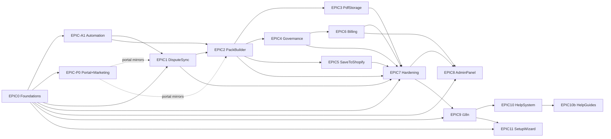

# DisputeDesk V1 Roadmap

> **Last updated:** 2026-03-27  
> **Epic plan (single readable sheet):** [`docs/epics/EPIC-PLAN.md`](epics/EPIC-PLAN.md) — start there if the table + diagram below are hard to follow.

## Progress

| Epic | Name | Status | Week | Doc |
|------|------|--------|------|-----|
| 0 | Foundations | DONE | 1 | [EPIC-0](epics/EPIC-0-foundations.md) |
| P0 | External Portal + Marketing | DONE | 0-1 | [EPIC-P0](epics/EPIC-P0-portal-marketing.md) |
| A1 | Automation Pipeline | In Progress | 1-3 | [EPIC-A1](epics/EPIC-A1-automation-pipeline.md) |
| 1 | Dispute Sync | DONE | 1-2 | [EPIC-1](epics/EPIC-1-dispute-sync.md) |
| 2 | Evidence Pack Builder | DONE | 2-3 | [EPIC-2](epics/EPIC-2-evidence-pack-builder.md) |
| 3 | PDF Rendering & Storage | DONE | 3 | [EPIC-3](epics/EPIC-3-pdf-rendering.md) |
| 4 | Governance & Review Queue | DONE | 3-4 | [EPIC-4](epics/EPIC-4-governance.md) |
| 5 | Save Evidence to Shopify | DONE | 4 | [EPIC-5](epics/EPIC-5-save-to-shopify.md) |
| 6 | Billing & Plan Limits | DONE | 5 | [EPIC-6](epics/EPIC-6-billing.md) |
| 7 | Hardening | DONE | 5-6 | [EPIC-7](epics/EPIC-7-hardening.md) |
| 8 | Internal Admin Panel | DONE | 6-7 | [EPIC-8](epics/EPIC-8-admin-panel.md) |
| 9 | Multi-Language (i18n) | DONE | 7-8 | [EPIC-9](epics/EPIC-9-i18n.md) |
| 10 | User Help System | DONE | 8 | [EPIC-10](epics/EPIC-10-help-system.md) |
| 10b | Interactive Help Guides | DONE | 8 | — |
| 11 | Setup Wizard & Onboarding | DONE | 9 | — |

## Dependency Chain

## Product Model

DisputeDesk is **automation-first**:

1. **Connect once** — install from Shopify App Store.
2. **Auto-build** — when a dispute appears, DisputeDesk generates an evidence
   pack automatically (order, tracking, policies, uploads).
3. **Auto-save** — when the pack passes rules (completeness score + no blockers),
   evidence is saved to Shopify via API.
4. **Submit in Shopify** — submission to the card network happens in Shopify
   Admin, or Shopify auto-submits on the due date.

DisputeDesk does NOT submit responses to card networks on behalf of merchants.

## Content Hub (marketing CMS)

**Not** EPIC **P0** (portal track). Use phase codes **CH-1 through CH-7** so nothing collides with "P0". **Canonical plan:** [`docs/epics/RESOURCE-HUB-PLAN.md`](epics/RESOURCE-HUB-PLAN.md). Overview in [`docs/epics/EPIC-PLAN.md` §5](epics/EPIC-PLAN.md#5-content-hub-marketing-cms--separate-track). Technical detail: **`docs/technical.md` § Resources Hub**.

| Phase | Focus | Status |
|-------|--------|--------|
| **CH-1** | Public hub routes, Supabase content tables, admin tools, publish cron, hub shell + i18n | Done |
| **CH-2** | Admin shell + component system + workflow migration + query layer | Done |
| **CH-3** | Dashboard + Content List (first 2 operational screens) | Done |
| **CH-4** | Block editor + locale editing (rich content editor) | Done |
| **CH-5** | Backlog + Calendar + Queue (3 operational screens) | Done |
| **CH-6** | Settings + polish + mobile editor | Done |
| **CH-7** | Article generation pipeline (archive → briefs → drafts → review) | Active (parallel) |

**Operator guide:** [`docs/resources-hub-editor-guide.md`](resources-hub-editor-guide.md)  
**Embedded app:** Hub is not linked from `/app/*`; iframe navigations to hub URLs with `?host=` redirect to `/app/help` (see middleware).

## Notes

- **EPIC A1** is the automation pivot: it adds the pipeline, settings, and
  completeness engine that all downstream epics build on.
- **EPIC P0** delivers the marketing + portal UI.
- Portal placeholder pages are wired to real data as each epic completes.
- Embedded app inside Shopify Admin remains the primary surface.
- **EPIC 10b** adds interactive guided tours on top of the static help articles.
- **EPIC 11** adds the 7-step setup wizard with dashboard checklist card
  (connect → goals → disputes → packs → rules → policies → team; billing, settings, and help are app sections only), Evidence Sources V1 (Gorgias connect + sample files), and the onboarding state machine.
- **Shopify App Store:** App registered in Shopify Partners. OAuth installs
  working (cookieless state token). Dispute evidence write scopes
  (`read_shopify_payments_dispute_evidences`,
  `write_shopify_payments_dispute_evidences`) pending Shopify approval;
  portal uses "Open in Shopify Admin" + copy-to-clipboard workaround.
