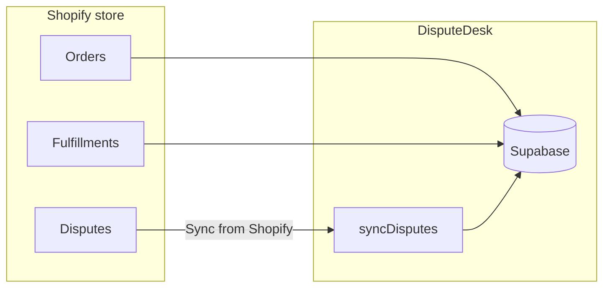

# Testing: Mirror a Shopify store

This doc describes how to create **Shopify-backed** test data so DisputeDesk can be tested against real store data. Mirroring means: **data exists in Shopify first** and is synced into Supabase. Supabase is a cache/sync layer; Shopify is the source of truth.

## Mental model

- **Shopify store** = source of truth. Orders, transactions, fulfillments, and disputes (when they exist) live in Shopify.
- **Supabase** = cache/sync. Our app reads from Shopify (and optionally writes evidence back). We do not invent dispute rows that do not exist in Shopify and call that “mirroring.”



## What can be created via Shopify Admin API

| Data | Create via Admin API? | Notes |
|------|------------------------|-------|
| **Orders** | Yes | REST `POST /orders.json` or GraphQL |
| **Fulfillments / tracking** | Yes | GraphQL `fulfillmentCreate`, `fulfillmentEventCreate` |
| **Disputes / chargebacks** | **No** | No API to create disputes. They are created by the card network or by Shopify when you use the **dispute test card** in Test Mode. |

So: we can mirror orders and fulfillments by running a seed script. We cannot programmatically create disputes in Shopify; real test disputes require the test-card checkout flow below.

---

## Golden path: mirrored test data

### Step 1 — Create orders and fulfillments in Shopify

Run the store seed script so the **Shopify store** has orders and fulfillments:

```bash
npm run seed:shopify
```

This runs [scripts/shopify/seed-teststore.mjs](scripts/shopify/seed-teststore.mjs). It uses the Shopify Admin API to create orders (REST) and fulfillments + tracking events (GraphQL). Configure auth and store in `.env.local`; see [scripts/shopify/README.md](scripts/shopify/README.md).

After this step, the store has transactions (orders + fulfillments). It does **not** yet have disputes.

### Step 2 — Create real disputes in Shopify (Test Mode + test card)

Disputes cannot be created via API. To get real disputes **in the store**:

1. **Enable Shopify Payments Test Mode** on the development store:
   - In **Shopify Admin**: **Settings → Payments → Shopify Payments**.
   - Use a **development store** (Partner Dashboard). For dev stores, you can enable **Test mode** (or use a test payment provider).
   - Ensure the store can accept test payments. If using Shopify Payments, open the **Manage** / **Activate** flow and complete test activation if required for your region.

2. **Place a checkout that will become a dispute** using Shopify’s dispute test card:
   - Card number: **`4000000000000259`** (this card is designed to trigger a dispute in Test Mode).
   - Use any future expiry, any CVC, and any billing details. Complete checkout on the store’s checkout page (e.g. your-store.myshopify.com/checkout or a test checkout link).

3. After the transaction is created, Shopify will mark it as disputed in Test Mode. The dispute will appear under **Shopify Admin → Finances → Disputes** (or the disputes section for your store).

You now have **real disputes in Shopify**. The next step syncs them into our app.

### Step 3 — Sync disputes into Supabase

Pull disputes from Shopify into Supabase so the app shows them:

- **In the app:** Open the Disputes page and click **Sync Now** (or the equivalent sync action for the embedded or portal app).
- **Via API:** Call `POST /api/disputes/sync` with body `{ "shop_id": "<your-shop-uuid>" }`. The shop UUID is the `id` from the `shops` table in Supabase for the store you seeded.

After sync, disputes that exist in Shopify will appear in the app; they are **mirrored** (sourced from Shopify).

---

## Troubleshooting: disputes do not appear

- **Sync not run:** Ensure you clicked Sync in the app or called `POST /api/disputes/sync` after creating the test-card dispute in Shopify.
- **Wrong shop:** Confirm `shop_id` in the sync request matches the store where you ran the seed and used the test card. Check `shops` table in Supabase.
- **No offline session:** The sync uses the store’s offline session (access token). The app must have been installed on that store at least once so Supabase has a `shop_sessions` row for that shop with a valid token.
- **Test mode / test card:** The dispute test card (`4000000000000259`) only generates a dispute when Shopify Payments (or the test payment flow) is in Test Mode and the transaction is completed. Verify in Shopify Admin → Finances → Disputes that the dispute exists before syncing.
- **Scopes:** The app must have `read_shopify_payments_disputes` (and any other required dispute scopes) and be reinstalled after scope changes.

---

## Synthetic disputes (DB-only) — not mirrored

For **UI or dev convenience**, you can insert dispute-like rows **only in Supabase** (they do **not** exist in Shopify). These are **synthetic** and must never be described as mirrored.

- **Script:** `npm run seed:synthetic-disputes` (runs [scripts/seed-synthetic-disputes.mjs](scripts/seed-synthetic-disputes.mjs)).
- **Purpose:** So the app has rows to display for layout/flows without using Shopify Test Mode or the test card.
- **Important:** Synthetic disputes are for UI/dev only; they are **not** mirrored from Shopify. In the app they are labeled with a **Synthetic** badge so they are not confused with Shopify-sourced disputes.
